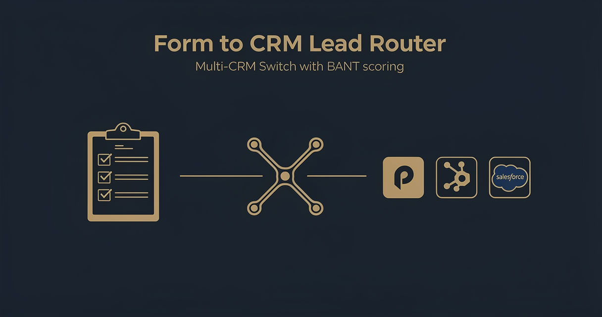

<!-- studiomeyer-mcp-stack-banner:start -->
> **Part of the [StudioMeyer MCP Stack](https://studiomeyer.io)**, Built in Mallorca · ⭐ if you use it
<!-- studiomeyer-mcp-stack-banner:end -->

# Form to CRM Lead Router

> Form fires, BANT-style scoring decides hot / warm / cold, multi-CRM Switch routes to Pipedrive (default), HubSpot, or Salesforce. With HMAC verification, idempotency, rate limit, error branch.



## What this does

A form provider (Webflow, Tally, Typeform, custom HTML) POSTs a lead submission to the n8n webhook, the workflow normalizes the payload into a stable schema, runs a BANT scoring rubric (Budget, Authority, Need, Timeline, plus Intent), classifies the lead as hot / warm / cold, and creates a deal in the configured CRM at the matching pipeline stage. Slack ops channel gets a one-line notification.

The result is a router that gives you per-lead temperature classification and per-CRM portability (swap Pipedrive for HubSpot or Salesforce by flipping one env var). The four production patterns mean public form webhooks are not a billing-spike vector and form-provider retries do not duplicate deals.

## Architecture

```
[Form Webhook]                       ← rawBody for HMAC
    │
    ▼
[Verify Webhook (opt-in)]            ← LEAD_FORM_SIGNING_SECRET + WEBHOOK_INTEGRITY_CHECK_ENABLED=1
    │
    ▼
[Rate Limit (opt-in)]                ← RATE_LIMIT_ENABLED=1, 60 req / 5 min / IP
    │
    ▼
[Idempotency Check (opt-in)]         ← IDEMPOTENCY_ENABLED=1, dedup on submission_id || email + minute-bucket
    │
    ▼
[Normalize Payload]                  ← maps Webflow / Tally / Typeform field names to a stable schema
    │
    ▼
[BANT Score]                         ← 0-100 score from BANT fields, classifies hot / warm / cold
    │
    ▼
[Set CRM Target]                     ← reads CRM_TARGET env, picks stage_id from temperature
    │
    ▼
[Route by CRM] ──────────────────┐
    ├── pipedrive ─► [Pipedrive Create Deal]    onError ─┐
    ├── hubspot   ─► [HubSpot Create Deal]      onError ─┤
    └── salesforce─► [Salesforce Create Deal]   onError ─┤
                              │                          │
                              ▼                          ▼
                     [Normalize CRM Output]      [Error Fallback]
                              │                          │
                              ▼                          ▼
                     [Slack Ops Notification]    [Error Slack Alert]
                              │                          │
                              ▼                          ▼
                     [Respond to Form]           [Error Respond to Form]
```

## Setup

1. **Import this workflow.** Top-right menu in n8n, Import from clipboard, paste the contents of `workflow.json`.
2. **Activate the webhook** in n8n. Copy the production webhook URL.
3. **Configure your form provider** to POST to that URL on submission. Headers should include `Content-Type: application/json`.
4. **Set `CRM_TARGET`** in your n8n env. One of `pipedrive` (default), `hubspot`, `salesforce`.
5. **Set CRM stage IDs** in your n8n env: `CRM_PIPELINE_HOT_ID`, `CRM_PIPELINE_WARM_ID`, `CRM_PIPELINE_COLD_ID`. These are the pipeline stage IDs in your CRM where leads of each temperature should land.
6. **Set `SLACK_OPS_WEBHOOK`** to your Slack incoming-webhook URL for ops notifications.
7. **Add CRM credentials** in n8n's credential store. Pipedrive API token, or HubSpot OAuth, or Salesforce OAuth (depending on your `CRM_TARGET`).
8. **Production patterns (optional but recommended for production):** set `WEBHOOK_INTEGRITY_CHECK_ENABLED=1`, `LEAD_FORM_SIGNING_SECRET=<32-char-random>` (and configure the same secret in your form provider), `RATE_LIMIT_ENABLED=1`, `IDEMPOTENCY_ENABLED=1`.
9. **Test.** Send a sample payload from `examples/form-submit.json` via curl, check the CRM for the new deal.

### Form provider HMAC setup

Each form provider has its own way of signing webhooks. For a custom HTML form, sign in your backend before forwarding:

```js
// Pseudocode for your form-handler endpoint
const crypto = require('crypto');
const signature = crypto.createHmac('sha256', process.env.LEAD_FORM_SIGNING_SECRET)
  .update(rawBody, 'utf8')
  .digest('hex');
fetch(N8N_WEBHOOK_URL, {
  method: 'POST',
  body: rawBody,
  headers: { 'Content-Type': 'application/json', 'x-form-signature': signature },
});
```

## Extending

**Lead enrichment.** After `Normalize Payload`, add an HTTP Request node that calls Clearbit, Apollo, or Hunter.io with the email to enrich the lead with company size, revenue band, tech stack. Feed the enriched fields into the BANT score (e.g. company size > 50 employees adds 10 points to authority).

**Multi-stage qualification.** After `BANT Score`, branch hot leads into a separate Slack channel for sales reps and warm leads into an automated email nurture sequence (Brevo / Mailchimp HTTP Request nodes). Cold leads still get logged in CRM but skip the Slack notification.

**Anti-fraud filter.** Add a Code node after `Normalize Payload` that checks the email against disposable-email-domain blocklists (mailinator, yopmail, guerrillamail) and the IP against a public abuse list. Reject before scoring.

**Webhook signature for Webflow / Typeform / Tally.** Each provider has its own signature header (`x-webflow-signature`, `Typeform-Signature`, `Tally-Signature`). Adapt the `Verify Webhook` Code node's header lookup and HMAC algorithm per provider. Tally uses HMAC-SHA256 of raw body, Typeform uses HMAC-SHA256 with timestamp prefix similar to Stripe.

## Cost notes

| Component | Cost (Stand 2026-05) | Per-execution cost |
|---|---|---|
| **n8n** (self-hosted) | free | $0 |
| **n8n Cloud** | from $20/mo | included |
| **Pipedrive API** | included in plan | free up to your plan limit |
| **HubSpot API** | included in plan | free up to your plan limit |
| **Salesforce API** | varies | varies |
| **Slack incoming webhooks** | free | $0 |

Per-execution cost: $0. The workflow makes one CRM API call + one Slack call. Both are free within standard plan limits.

**Worked example at 500 leads / month:** $0 in template-direct costs (you already pay for n8n and your CRM regardless).

## Common gotchas

- **Form provider does not send your custom field names.** Webflow flattens nested fields into `data['Field Name']` with the human-readable label. Tally sends an array of `{question, answer}` objects. Typeform sends `form_response.answers[]` with type-coded values. The `Normalize Payload` Code node has a flexible `pick(...keys)` helper, but you may need to adapt it per provider. Inspect a real submission's payload first (set the workflow to Test mode and submit once).
- **CRM stage IDs are environment-specific.** A Pipedrive sandbox has different stage IDs than production. Always pull the IDs from the CRM you are targeting and set them in env vars, never hardcode.
- **Salesforce REST URL contains your org subdomain.** The Salesforce HTTP Request node has `https://your-instance.my.salesforce.com` as a placeholder. Replace `your-instance` with your actual subdomain (or load it from an env var).
- **n8n core HTTP request body shape.** The HTTP Request node's body parameter expects a string when you send JSON, not a JSON object. Wrap with `JSON.stringify({...})` in expressions. The template uses this pattern in the HubSpot, Salesforce, and Slack nodes.
- **n8n error syntax.** Inline error pin uses `{{ $json.error.message }}`. Separate Error Trigger Workflow uses `{{ $json.execution.error.message }}` + `{{ $json.workflow.name }}`. Often-quoted `{{ $error.message }}` does not exist.

## Production patterns

Four patterns ship as actual nodes in `workflow.json`. Three opt-in via env vars and one always-on error branch.

**Idempotency** (opt-in, `IDEMPOTENCY_ENABLED=1`). The `Idempotency Check` Code node holds a 5-minute in-memory window of seen submission IDs (or email + minute-bucket if no submission ID is provided) via `$getWorkflowStaticData('global')`. Form providers retry on 5xx. Without dedup, every retry creates a duplicate deal in your CRM and a duplicate Slack notification. Default-off so the import boots clean. For clustered n8n, swap to Redis `SET NX EX 300`. Snippet in the node's comments.

**Rate limiting** (opt-in, `RATE_LIMIT_ENABLED=1`). Per-IP sliding window. 60 requests per 5 minutes per IP. Map bounded at 5000 entries with eviction. Defense-in-depth, not the primary control. For real production loads, put the limit on a reverse proxy (Nginx `limit_req_zone`, Cloudflare WAF, Traefik).

**Webhook HMAC verification** (opt-in, `LEAD_FORM_SIGNING_SECRET` + `WEBHOOK_INTEGRITY_CHECK_ENABLED=1`). HMAC-SHA256 of raw body compared against `x-form-signature` header with `crypto.timingSafeEqual`. Length-guard before the timing-safe compare prevents `RangeError` DoS.

**Error branches** (always on). All three CRM HTTP Request nodes plus the Slack Ops Notification have `On Error: Continue (Using Error Output)` enabled. The error pin lands at `Error Fallback` which builds a structured error log with submission ID, target, error message, and feeds two destinations: `Error Slack Alert` (so ops sees the failure) and `Error Respond to Form` (so the submitter sees a 200 instead of a hung request). Memory de-duplication is server-side in [StudioMeyer Memory](https://memory.studiomeyer.io) which this template does not use, see the sister [n8n-templates](https://github.com/studiomeyer-io/n8n-templates) repo for memory-backed variants.

## Hard compatibility floor

**Minimum n8n version with CVE-2026-27493 fix:** >= 2.9.3 (stable channel) / >= 2.10.1 (latest / beta channel) / >= 1.123.22 (1.x LTS). CVE-2026-27493 is an unauthenticated RCE in Form nodes (CVSS 9.5). This template does not use Form nodes itself (it uses a Webhook node), but you should still upgrade for general security.

**Self-hosted Node builtins:** the `Verify Webhook` Code node uses `require('crypto')`. Set `NODE_FUNCTION_ALLOW_BUILTIN=crypto` in your n8n env. n8n Cloud has this allowed by default for hosted plans, verify in your tenant.

## Tech stack matrix

| Component | Version | Cost | Free tier | Required when |
|---|---|---|---|---|
| n8n | >= 2.10.1 (CVE-2026-27493 floor) | self-hosted free / Cloud $20/mo | n8n Cloud trial | always |
| Pipedrive | API token | included in plan | Pipedrive Essential | CRM_TARGET=pipedrive |
| HubSpot | OAuth | included in plan | HubSpot Free CRM | CRM_TARGET=hubspot |
| Salesforce | OAuth | varies by plan | Developer Edition | CRM_TARGET=salesforce |
| Slack | incoming webhook | free | always | always (ops channel) |
| Form provider | varies | varies | varies | always |

## Credentials checklist

Before activation, create these credentials in n8n:

- [ ] **Pipedrive API** (`pipedriveApi`) OR **HubSpot OAuth** (`hubspotApi`) OR **Salesforce OAuth** (`salesforceApi`). Get tokens from your CRM admin panel.
- [ ] **Slack incoming webhook URL** in `SLACK_OPS_WEBHOOK` env var. Create at api.slack.com, App, Incoming Webhooks.
- [ ] **Webhook signing secret (recommended).** Set `LEAD_FORM_SIGNING_SECRET` to a strong 32+ char random string. Configure the same secret in your form provider's webhook settings. Set `WEBHOOK_INTEGRITY_CHECK_ENABLED=1`.

## Need cross-session memory?

This template treats each lead as independent. If you want to recognize returning leads (the same email submits the form twice over a year, the workflow recognizes them and updates an existing deal instead of creating a duplicate), see the sister [studiomeyer-io/n8n-templates](https://github.com/studiomeyer-io/n8n-templates) repo. Specifically Template 02 (Customer Support with History) shows the entity-search-then-decide pattern that applies one-to-one to leads.

## Related templates

- [02 - Stripe Lifecycle to Slack](../02-stripe-lifecycle-to-slack/) · related Slack notification pattern
- [03 - Uptime Monitor with Alerts](../03-uptime-monitor-with-alerts/) · alert pattern for ops channels

---

*Built by [StudioMeyer](https://studiomeyer.io) in Mallorca. Issues + ideas at [github.com/studiomeyer-io/n8n-workflows/issues](https://github.com/studiomeyer-io/n8n-workflows/issues).*
