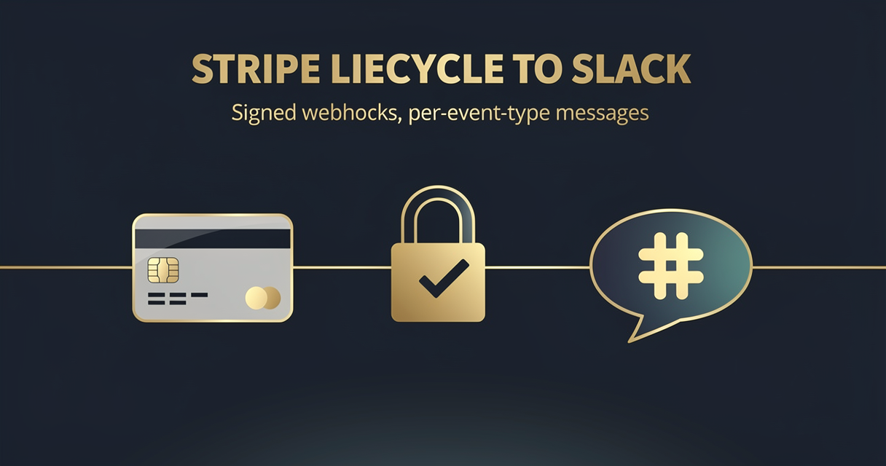

<!-- studiomeyer-mcp-stack-banner:start -->
> **Part of the [StudioMeyer MCP Stack](https://studiomeyer.io)**, Built in Mallorca · ⭐ if you use it
<!-- studiomeyer-mcp-stack-banner:end -->

# Stripe Lifecycle to Slack

> Stripe webhook lands, signature verified with timestamp + replay-window, per-event-type Slack message goes out in Block Kit format. No memory, no LLM, free to run.



## What this does

A Stripe webhook fires (checkout completed, subscription created or cancelled, payment failed). The workflow verifies the `Stripe-Signature` header against your `STRIPE_WEBHOOK_SECRET` (timestamp + HMAC-SHA256, 5-min replay window), normalizes the event into a stable shape, builds a Slack Block Kit message tuned per event type (paid customer green, cancellation red, payment failure red with siren), and POSTs to a Slack incoming webhook.

The result is a billing channel in Slack that does not miss events, does not duplicate events on Stripe retries, and rejects forged events. The four production patterns mean the public webhook URL is not a billing-spike vector.

## Architecture

```
[Stripe Webhook]                     ← rawBody for HMAC
    │
    ▼
[Verify Stripe Signature (opt-in)]   ← STRIPE_WEBHOOK_SECRET + WEBHOOK_INTEGRITY_CHECK_ENABLED=1
    │                                   parses t=<ts>,v1=<hmac>, checks 5-min replay window
    ▼
[Rate Limit (opt-in)]                ← RATE_LIMIT_ENABLED=1, 60 / 5 min / customer
    │
    ▼
[Idempotency Check (opt-in)]         ← IDEMPOTENCY_ENABLED=1, 24h dedup on event.id
    │
    ▼
[Normalize Event]                    ← extracts customer, amount, plan, status across event types
    │
    ▼
[Build Slack Message]                ← per-event-type Block Kit, color-coded
    │
    ▼
[Slack Billing Notification]   onError ─► [Error Fallback]
    │                                          │
    ▼                                          ▼
[Respond to Stripe]                   [Error Respond to Stripe]
```

## Setup

1. **Import this workflow.**
2. **Activate the webhook** in n8n. Copy the production URL.
3. **In Stripe Dashboard**, Developers, Webhooks, Add endpoint. Paste the n8n URL.
4. **Subscribe to events:** `checkout.session.completed`, `customer.subscription.created`, `customer.subscription.updated`, `customer.subscription.deleted`, `invoice.payment_failed`. Add more if you want, the workflow falls through to a generic message for unknown types.
5. **Copy the signing secret** (starts with `whsec_`) from Stripe and set as n8n env var `STRIPE_WEBHOOK_SECRET`.
6. **Set `WEBHOOK_INTEGRITY_CHECK_ENABLED=1`** to enforce signature verification.
7. **Configure Slack webhook.** Create an incoming webhook at api.slack.com, set as `SLACK_BILLING_WEBHOOK` env var.
8. **Test.** Send a test event from Stripe Dashboard, Webhooks, your endpoint, Send test webhook. Pick `checkout.session.completed`, watch your Slack channel for the green message.

## Extending

**Per-channel routing.** Add an `If` node before `Slack Billing Notification` that branches by event type or amount. Critical events (`invoice.payment_failed`, large MRR loss) go to a sales-ops channel. Routine events go to a billing channel.

**Customer-portal link.** Stripe Customer Portal supports magic links via Customer Sessions. Add a Code node after `Normalize Event` that generates a portal link via the Stripe API, embed in the Slack message as a button. Users click the button in Slack to jump straight to the customer's billing record.

**Anti-fraud signal.** Add a Code node that flags suspicious patterns (high-amount with no prior history, payment from a country far from billing address, multiple failed payments in 24h). Route these to a fraud-review channel and pause the subscription via a Stripe API call.

**Cross-link to CRM.** After `Normalize Event`, call your CRM API (Pipedrive / HubSpot) to update the customer's lifecycle stage. New paid customer becomes "Customer", cancellation becomes "Churned", payment failure becomes "At Risk". This pattern is a natural extension of [Template 01 Form to CRM Lead Router](../01-form-to-crm-lead-router/).

## Cost notes

| Component | Cost (Stand 2026-05) | Per-execution cost |
|---|---|---|
| **n8n** (self-hosted) | free | $0 |
| **Stripe webhook delivery** | free | $0 |
| **Slack incoming webhook** | free | $0 |

Per-execution cost: $0. The workflow makes one Slack call per event, no other paid APIs.

**Worked example at 1000 events / month** (typical SaaS at $10k MRR with mixed checkout + subscription events): $0 in template-direct costs.

## Common gotchas

- **Test mode events have `livemode: false`.** The template adds a `:warning: TEST` prefix to the Slack header for non-livemode events. Useful when staging and production share a Slack channel. Drop the prefix in production-only deployments by editing `Build Slack Message` Code node.
- **Stripe signature header carries multiple `v1=` signatures during key rotation.** The verifier loops over all `v1=` signatures and accepts a match against any. This is correct per Stripe docs.
- **Stripe sends events older than 5 minutes during replay.** If you replay events from the Stripe Dashboard the timestamp is the original. The 5-minute replay window will reject these. Increase the window in `Verify Stripe Signature` Code node (`REPLAY_WINDOW_S = 300` constant) for replay testing, set back to 300 for production.
- **Slack webhook URL is a secret.** Do not commit it. Always env-var. The `SLACK_BILLING_WEBHOOK` is referenced via `{{ $env.SLACK_BILLING_WEBHOOK }}` so it never appears in the workflow.json.
- **n8n error syntax.** Inline error pin uses `{{ $json.error.message }}`. The often-quoted `{{ $error.message }}` does not exist.

## Production patterns

Four patterns ship as actual nodes in `workflow.json`. Three opt-in via env vars and one always-on error branch.

**Verify Stripe Signature** (opt-in, `STRIPE_WEBHOOK_SECRET` + `WEBHOOK_INTEGRITY_CHECK_ENABLED=1`). Stripe-specific HMAC. Parses `Stripe-Signature` header in `t=<timestamp>,v1=<hmac>` format. Rejects events older than 5 minutes (replay-window). Constant-time-compares HMAC-SHA256 of `<timestamp>.<rawBody>` against any `v1=` value (Stripe rotates keys, multiple signatures during rotation). Length-guard before the timing-safe compare.

**Rate limiting** (opt-in, `RATE_LIMIT_ENABLED=1`). Per-customer sliding window. 60 events per 5 minutes per customer. Defends against a leaked signing secret being used to spam events for one customer. Map bounded at 5000 entries with eviction.

**Idempotency** (opt-in, `IDEMPOTENCY_ENABLED=1`). 24-hour dedup on Stripe `event.id`. Stripe retries failed deliveries up to 3 days, the 24h window covers the typical retry pattern without unbounded memory growth.

**Error branches** (always on). Slack Billing Notification has `On Error: Continue (Using Error Output)` enabled. The error pin lands at `Error Fallback` which builds a structured error log and feeds `Error Respond to Stripe` so the webhook returns 200 (Stripe does not retry on 200). The Slack delivery failure surfaces via the n8n execution log instead. If you would rather have Stripe retry on Slack failures, change the response code to 500.

## Hard compatibility floor

**Minimum n8n version:** >= 2.9.3 / >= 2.10.1 / >= 1.123.22 (CVE-2026-27493). See top-level [README](../../README.md) for the full version-floor explanation.

**Self-hosted Node builtins:** the `Verify Stripe Signature` Code node uses `require('crypto')`. Set `NODE_FUNCTION_ALLOW_BUILTIN=crypto`.

## Tech stack matrix

| Component | Version | Cost | Free tier | Required when |
|---|---|---|---|---|
| n8n | >= 2.10.1 | self-hosted free | always | always |
| Stripe | API 2024-12-18 or later | included in plan | always | always |
| Slack incoming webhook | latest | free | always | always |

## Credentials checklist

Before activation, configure these in your n8n environment:

- [ ] **`STRIPE_WEBHOOK_SECRET`** env var. Get from Stripe Dashboard, Developers, Webhooks, your endpoint. Format `whsec_...`.
- [ ] **`WEBHOOK_INTEGRITY_CHECK_ENABLED=1`** env var to enforce signature verification.
- [ ] **`SLACK_BILLING_WEBHOOK`** env var. Slack incoming webhook URL.
- [ ] **`RATE_LIMIT_ENABLED=1`** + **`IDEMPOTENCY_ENABLED=1`** env vars (recommended for production).

## Need cross-session memory?

This template treats each Stripe event as independent. If you want to track a customer's full lifecycle (first checkout, plan upgrades, churn risk over time, win-back attempts), see the sister [studiomeyer-io/n8n-templates](https://github.com/studiomeyer-io/n8n-templates) repo for memory-backed variants.

## Related templates

- [01 - Form to CRM Lead Router](../01-form-to-crm-lead-router/) · related lifecycle stage update on subscription events
- [05 - Slack Channel Daily Digest](../05-slack-channel-daily-digest/) · related Slack output pattern

---

*Built by [StudioMeyer](https://studiomeyer.io) in Mallorca. Issues + ideas at [github.com/studiomeyer-io/n8n-workflows/issues](https://github.com/studiomeyer-io/n8n-workflows/issues).*
