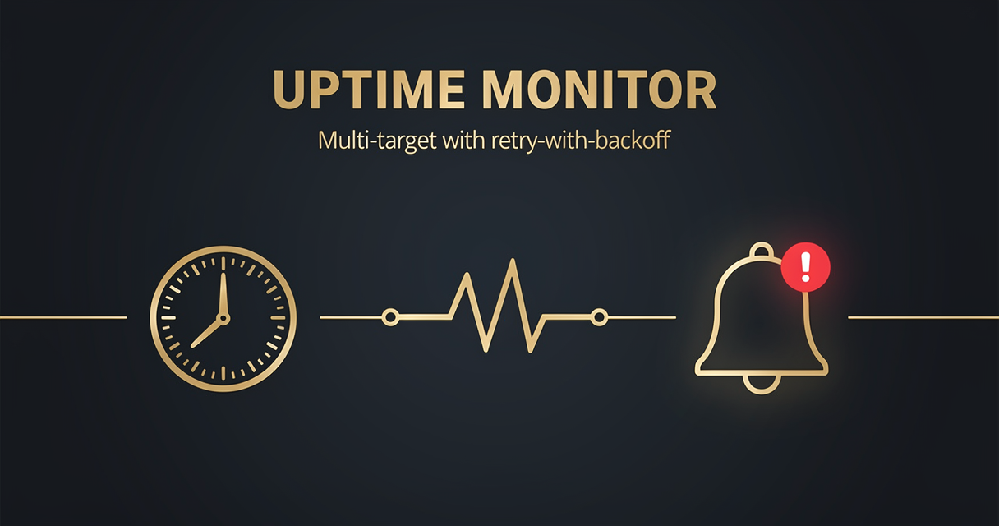

<!-- studiomeyer-mcp-stack-banner:start -->
> **Part of the [StudioMeyer MCP Stack](https://studiomeyer.io)**, Built in Mallorca · ⭐ if you use it
<!-- studiomeyer-mcp-stack-banner:end -->

# Uptime Monitor with Alerts

> Schedule-driven HTTP health check across multiple targets. Alerts on state transitions only (up to down, down to up), not on every cycle. Slack + Telegram in parallel.



## What this does

Every 5 minutes (configurable), the workflow fetches a list of targets from your `MONITOR_TARGETS` env var (a JSON array of `{name, url, expect_status}`), checks each via HTTP GET with retry-with-backoff (3 attempts, 2s between), classifies the response as up or down, compares against the last known state, and alerts only on transitions. Slack and Telegram fire in parallel so you do not depend on one channel staying up.

The result is an uptime monitor that does not spam alerts on persistent outages, recognizes recoveries, and survives transient blips. No memory, no LLM, runs free on n8n self-hosted or Cloud.

## Architecture

```
[Schedule Trigger]                    ← every 5 min default
    │
    ▼
[Load Targets]                        ← parses MONITOR_TARGETS JSON env
    │ (one item per target)
    ▼
[HTTP Health Check]    onError ────► [Mark Down]
    │ retry 3x, 2s wait
    ▼
[Mark Up]                              [Mark Down]
    │                                       │
    └─────────────┬─────────────────────────┘
                  ▼
       [State Change Detector]              ← persists last state per target
                  │
                  ▼
              [Should Alert?]
                  │ true
                  ├──► [Slack Alert]    onError ─┐
                  └──► [Telegram Alert] onError ─┤
                                                 ▼
                                        [Error Fallback]
```

## Setup

1. **Import this workflow.**
2. **Set `MONITOR_TARGETS`** as a JSON array of targets:
   ```json
   [
     {"name": "api", "url": "https://api.example.com/health", "expect_status": 200},
     {"name": "site", "url": "https://example.com", "expect_status": 200},
     {"name": "n8n-self", "url": "https://your-n8n.example.com/healthz", "expect_status": 200}
   ]
   ```
3. **Set `SLACK_OPS_WEBHOOK`** to your Slack incoming webhook URL.
4. **Set `TELEGRAM_BOT_TOKEN` + `TELEGRAM_CHAT_ID`** for Telegram alerts (optional, leave unset to skip).
5. **Adjust schedule cadence** in the Schedule Trigger node (default 5 minutes). Production typical is 1-5 minutes.
6. **Activate.** First cycle runs the check, no alerts on first cycle (no prior state to transition from). Second cycle starts state-change detection.

## Extending

**Per-target SLO targets.** Add a `slo_uptime_pct` field per target in `MONITOR_TARGETS`, accumulate up/down counts in `$getWorkflowStaticData`, alert when the rolling 24h uptime drops below the SLO. This turns a binary monitor into an SLO compliance monitor.

**Latency tracking.** The HTTP Health Check node already tracks response time. Capture it in `Mark Up` (read `$input.first().response.duration`), persist a rolling window of latencies per target, alert when p95 exceeds a threshold even if all checks return 200.

**Status page integration.** Add an HTTP Request node after `Mark Up` / `Mark Down` that POSTs the state to a hosted status page (BetterStack, Statuspage, Atlassian Statuspage). The state-change detection means the status page only updates on real transitions.

**Multi-region checks.** Run this template on multiple n8n instances in different regions (Frankfurt, Virginia, Singapore). Aggregate the results to detect single-region outages. Each instance keeps its own state in its own `$getWorkflowStaticData`, so no coordination is needed.

## Cost notes

| Component | Cost (Stand 2026-05) | Per-execution cost |
|---|---|---|
| **n8n** (self-hosted) | free | $0 |
| **Slack incoming webhook** | free | $0 |
| **Telegram Bot API** | free | $0 |

Per-execution cost: $0. Each cycle makes one HTTP call per target plus zero or two alert calls (only on transitions). At 5-minute cadence and 5 targets, that is 1440 health checks per day plus a handful of alerts. All free.

**Worked example at 5 targets, 5-minute cadence:** $0/month.

## Common gotchas

- **First cycle does not alert.** State-change detection requires a prior state. The first cycle records the initial state, the second compares. This is intentional, prevents false positives on workflow restart.
- **`$getWorkflowStaticData` resets when the workflow is deactivated and reactivated.** All targets become first-cycle on next activation. To preserve state across restarts, swap to a Postgres / Redis backing store (Code node, key `uptime:state:<target_name>`).
- **Network errors do not give an HTTP status code.** The `Mark Down` node falls back to `statusCode: 0` and pulls the error message from the n8n `error` object. The `errorMessage` field in the alert tells you whether it was a DNS failure, TLS error, timeout, etc.
- **Multiple targets share the rate limit.** Slack incoming webhooks are rate-limited at 1 message per second per webhook. If 10 targets transition simultaneously, the first goes through and the next 9 may be throttled. For high-target-count deployments, use a Slack app with `chat.postMessage` instead of incoming webhooks.
- **n8n error syntax.** Inline error pin uses `{{ $json.error.message }}`. Often-quoted `{{ $error.message }}` does not exist.

## Production patterns

This template's production patterns differ from webhook-triggered templates because there is no public webhook to verify. The patterns that ship:

**Retry-with-backoff** (always on). The HTTP Health Check node has `retryOnFail=true`, 3 attempts, 2-second wait between. Catches transient network blips that resolve within 5 seconds, prevents flapping alerts on glitchy connections.

**State-change-only alerting** (always on). Alerts fire on transitions only. The State Change Detector persists `lastStates[targetName]` in `$getWorkflowStaticData('global')` and only fires if the current state differs from the last. A target stuck "down" for 12 hours alerts once at the start of the outage and once at recovery, not 144 times.

**Error branches** (always on). Slack and Telegram alert nodes have `On Error: Continue (Using Error Output)` enabled. The error pin lands at `Error Fallback` which logs a structured error. Slack delivery failures do not crash the workflow.

**Schedule throttle** (built-in to n8n). The Schedule Trigger does not queue missed runs during downtime. If n8n is down for 2 hours, on restart the next cycle is the next scheduled time, not 24 backfill executions.

## Hard compatibility floor

**Minimum n8n version:** >= 2.9.3 / >= 2.10.1 / >= 1.123.22 (CVE-2026-27493).

## Tech stack matrix

| Component | Version | Cost | Free tier | Required |
|---|---|---|---|---|
| n8n | >= 2.10.1 | self-hosted free | always | always |
| Slack incoming webhook | latest | free | always | always |
| Telegram Bot API | latest | free | always | optional |

## Credentials checklist

- [ ] **`MONITOR_TARGETS`** env var. JSON array of targets.
- [ ] **`SLACK_OPS_WEBHOOK`** env var. Slack incoming webhook URL.
- [ ] **`TELEGRAM_BOT_TOKEN` + `TELEGRAM_CHAT_ID`** env vars. Optional, omit to skip Telegram.

## Need cross-session memory?

This template's state is local to the workflow's `$getWorkflowStaticData`. If you want longitudinal uptime data (rolling 30-day uptime per target, SLO compliance reports, per-customer status), see the sister [studiomeyer-io/n8n-templates](https://github.com/studiomeyer-io/n8n-templates) repo for memory-backed variants.

## Related templates

- [04 - SSL Certificate Expiry Watcher](../04-ssl-certificate-expiry-watcher/) · same schedule-driven pattern for cert expiry
- [02 - Stripe Lifecycle to Slack](../02-stripe-lifecycle-to-slack/) · related Slack alert pattern

---

*Built by [StudioMeyer](https://studiomeyer.io) in Mallorca. Issues + ideas at [github.com/studiomeyer-io/n8n-workflows/issues](https://github.com/studiomeyer-io/n8n-workflows/issues).*
