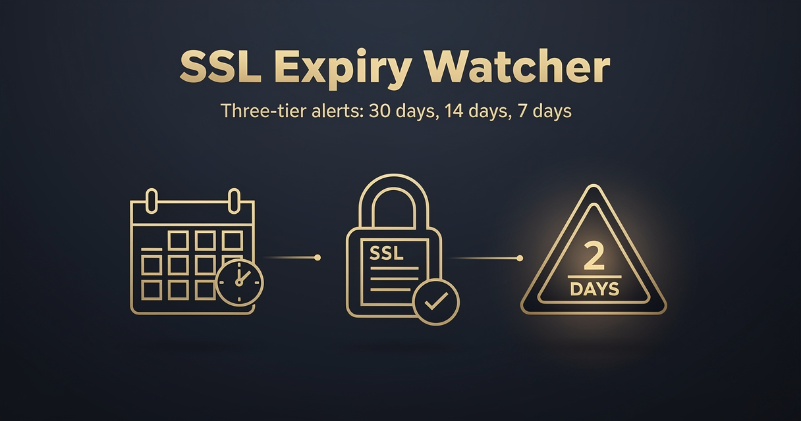

<!-- studiomeyer-mcp-stack-banner:start -->
> **Part of the [StudioMeyer MCP Stack](https://studiomeyer.io)**, Built in Mallorca · ⭐ if you use it
<!-- studiomeyer-mcp-stack-banner:end -->

# SSL Certificate Expiry Watcher

> Daily TLS check across multiple domains. Three-tier alert: warning <30 days, urgent <14 days, critical <7 days. Slack post per affected domain only.



## What this does

Once a day (default 09:00 UTC), the workflow reads `SSL_DOMAINS` (comma-separated list), TLS-connects to each domain on port 443, reads the peer certificate, computes days-until-expiry. Domains with more than 30 days remaining produce no output. Domains under 30 days produce a severity-coded Slack message: `:warning:` for warning, `:alarm_clock:` for urgent, `:rotating_light:` for critical, `:boom:` for TLS errors.

The result is a daily SSL summary in your ops channel. You learn about expiring certs 30 days out, get reminded at 14 days, get an alarm at 7 days. Letsencrypt renews automatically, but if your renewal cron breaks, you find out in time.

## Architecture

```
[Schedule Trigger]                   ← daily 09:00 UTC default
    │
    ▼
[Load Domains]                       ← parses SSL_DOMAINS comma-separated env
    │ (one item per domain)
    ▼
[Check Expiry]                       ← tls.connect, read cert, compute days_left
    │
    ▼
[Should Alert?]                      ← only if days_left < 30 or TLS error
    │ true
    ▼
[Build Slack Message]                ← severity-coded Block Kit
    │
    ▼
[Slack Alert]   onError ──► [Error Fallback]
```

## Setup

1. **Import this workflow.**
2. **Set `SSL_DOMAINS`** env var, comma-separated:
   ```
   SSL_DOMAINS=example.com,api.example.com,studiomeyer.io,memory.studiomeyer.io
   ```
3. **Set `SLACK_OPS_WEBHOOK`** for the alert channel.
4. **Adjust schedule** in the Schedule Trigger node. Default is daily 09:00 UTC. Cron expression `0 9 * * *`.
5. **Optional: adjust thresholds.** The `Check Expiry` Code node has `< 7`, `< 14`, `< 30` thresholds. Edit if your renewal lead time is different.
6. **Activate.** First execution checks all domains. Domains with more than 30 days do not alert. Domains under 30 days fire one alert per execution.

## Extending

**Per-domain ignore-list.** Add a property `SSL_IGNORE` env var (comma-separated). After `Load Domains`, drop any domain that matches the ignore list. Useful for staging domains where short-lived certs are expected.

**Multi-port check.** Some services run TLS on non-standard ports (gRPC at 8443, MQTT at 8883). Adjust the `Check Expiry` Code node to accept `domain:port` syntax in `SSL_DOMAINS` and pass `port` to `tls.connect`.

**Cert chain validation.** The current implementation reads the peer certificate. Extend to read the full chain (`socket.getPeerCertificate(true)` returns the full chain), check that the issuer chain is valid (e.g. issued by Letsencrypt, not by a self-signed cert that bypassed validation).

**Auto-renew trigger.** When `severity === 'urgent'` (under 14 days), trigger a Slack channel mention or call your CI to force a renew run. Add an HTTP Request node after `Should Alert?` that POSTs to your CI's webhook with the affected domain.

## Cost notes

Per-execution cost: $0. TLS connections to public ports are free, Slack incoming webhooks are free.

| Component | Cost (Stand 2026-05) |
|---|---|
| **n8n** (self-hosted or Cloud) | per your plan |
| **TLS connections** | free |
| **Slack incoming webhook** | free |

**Worked example at 20 domains, daily check:** $0/month.

## Common gotchas

- **Self-signed certs are rejected by default.** The `Check Expiry` Code node uses `rejectUnauthorized: true` (CA-validated) so a self-signed or chain-broken cert produces a TLS handshake error and lands in the error path. To monitor expiry on staging or internal mTLS endpoints where the chain does not validate, set `SSL_ACCEPT_SELFSIGNED=1` env var to opt in. Trade-off: with the override on, the watcher cannot tell a real cert from a tampered one, it just reports the expiry date encoded in whatever cert the peer presents.
- **TLS connection timeout.** The default timeout is 10s. Some servers behind aggressive WAFs may take longer to handshake. Bump `timeout: 10000` if you see false positives.
- **Cert covers multiple Subject Alternative Names (SAN).** The `subject.CN` field shows only the primary common name. If you monitor `api.example.com` and the cert is wildcard `*.example.com`, the subject will be `*.example.com`. Cross-check with the `subject.subjectAltName` field if needed.
- **Schedule trigger does not retry on failure.** If the daily run is missed (n8n down at 09:00), there is no automatic backfill. The next cycle runs the next day at 09:00. For higher reliability, increase the schedule cadence to twice-daily.
- **Severity tiers are independent of cert lifetime.** Letsencrypt issues 90-day certs. The 30/14/7 day thresholds are absolute, not percentages. Adjust if you use 30-day or 1-year certs.

## Production patterns

This template is schedule-driven, no public webhook to verify. The patterns that ship:

**Three-tier severity** (always on). Warning `<30 days` (yellow), urgent `<14 days` (orange), critical `<7 days` (red). The `Should Alert?` IF gates downstream alerts so domains with > 30 days remaining produce no output, no Slack noise.

**TLS-error path** (always on). If `tls.connect` itself fails (DNS error, connection refused, handshake failure), the `Check Expiry` Code node still emits an item with `severity: 'error'` and `shouldAlert: true`. The Slack message tells you the actual network error so you can debug.

**Error branches** (always on). The Slack Alert node has `On Error: Continue (Using Error Output)` enabled. The error pin lands at `Error Fallback` which logs the structured error.

**Schedule throttle** (built-in). Daily cron with no missed-run backfill.

## Hard compatibility floor

**Minimum n8n version:** >= 2.9.3 / >= 2.10.1 / >= 1.123.22 (CVE-2026-27493).

**Self-hosted Node builtins:** the `Check Expiry` Code node uses `require('tls')`. Set `NODE_FUNCTION_ALLOW_BUILTIN=tls` (or include `tls` in a comma-separated list with `crypto`).

## Tech stack matrix

| Component | Version | Cost | Free tier | Required |
|---|---|---|---|---|
| n8n | >= 2.10.1 | self-hosted free | always | always |
| Slack incoming webhook | latest | free | always | always |

## Credentials checklist

- [ ] **`SSL_DOMAINS`** env var. Comma-separated list of domains.
- [ ] **`SLACK_OPS_WEBHOOK`** env var. Slack incoming webhook URL.

## Need cross-session memory?

This template's state (last-known days_left per domain) is fresh on every cycle, no memory required. If you want longitudinal SSL data (alert history, renewal patterns, per-tenant cert tracking), see the sister [studiomeyer-io/n8n-templates](https://github.com/studiomeyer-io/n8n-templates) repo for memory-backed variants.

## Related templates

- [03 - Uptime Monitor with Alerts](../03-uptime-monitor-with-alerts/) · same schedule-driven pattern for HTTP health
- [02 - Stripe Lifecycle to Slack](../02-stripe-lifecycle-to-slack/) · same Slack alerting pattern

---

*Built by [StudioMeyer](https://studiomeyer.io) in Mallorca. Issues + ideas at [github.com/studiomeyer-io/n8n-workflows/issues](https://github.com/studiomeyer-io/n8n-workflows/issues).*
