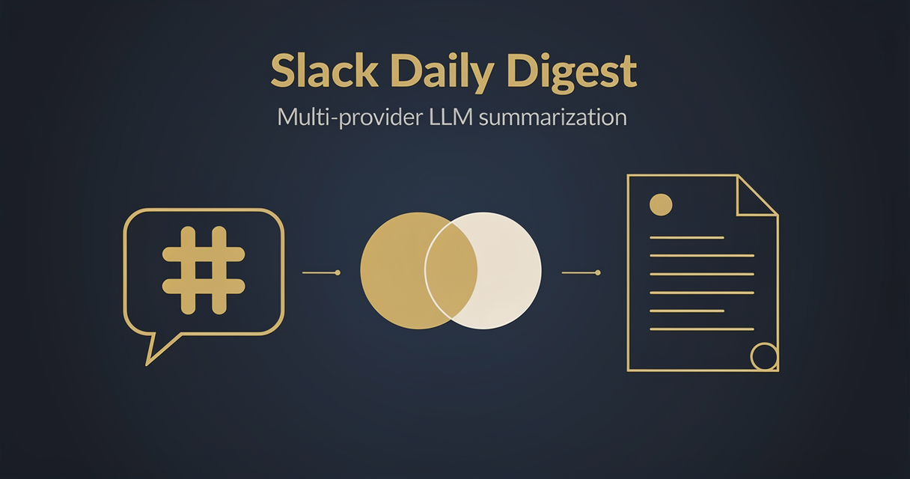

<!-- studiomeyer-mcp-stack-banner:start -->
> **Part of the [StudioMeyer MCP Stack](https://studiomeyer.io)**, Built in Mallorca · ⭐ if you use it
<!-- studiomeyer-mcp-stack-banner:end -->

# Slack Channel Daily Digest

> Pulls the last 24h of messages from a Slack channel, summarizes via OpenAI (default) or Anthropic, posts the digest back to a target channel. Multi-provider LLM Switch with proper router-fallback discrimination.



## What this does

Once a day (default 18:00 UTC), the workflow calls Slack's `conversations.history` API for the configured source channel, builds a compact transcript (drops bots, file uploads, thread broadcasts), caps it at 24000 characters (~6000 tokens), feeds it to your chosen LLM (`SLACK_DIGEST_PROVIDER=openai` default or `anthropic`), and posts a 4-7 bullet point summary back to the digest channel.

The result is a daily team digest that catches who said what without anyone reading 200 messages. The multi-provider Switch lets you swap OpenAI for Anthropic with one env var. The router-fallback discrimination means a typo in the provider value gives you a clear diagnostic without leaking the full transcript into the audit trail.

## Architecture

```
[Schedule Trigger]                    ← daily 18:00 UTC default
    │
    ▼
[Compute Time Window]                 ← oldest = now - 24h
    │
    ▼
[Slack: Fetch History]   onError ────► [LLM Fallback Reply]
    │
    ▼
[Build Transcript]                    ← compact text, drops bots, 24k char cap
    │
    ▼
[Build LLM Prompt]                    ← system + user prompt
    │
    ▼
[Route by Provider] ──┬─ openai ──► [OpenAI Reply]      onError ─┐
                      ├─ anthropic ► [Anthropic Reply]  onError ─┤
                      └─ fallback ─► [LLM Fallback Reply]        │
                                                                 │
                              ┌────────── [Normalize LLM Output] ┴──┐
                              ▼                                     ▼
                    [LLM Fallback Reply]                 [Post Digest to Slack]
                              │                                     │
                              └─────────────► [Post Digest to Slack]
```

## Setup

1. **Import this workflow.**
2. **Create a Slack app** at api.slack.com/apps. Add OAuth scopes: `channels:history`, `chat:write`, `groups:history` (for private channels). Install to workspace, copy the Bot User OAuth Token.
3. **Add Slack credentials** in n8n. Type: Slack OAuth2 API. Paste the Bot User OAuth Token.
4. **Set env vars:**
   - `SLACK_SOURCE_CHANNEL` to the channel ID to summarize (e.g. `C01ABCDE`).
   - `SLACK_DIGEST_CHANNEL` to the channel ID to post the digest into.
   - `SLACK_DIGEST_PROVIDER` to `openai` (default) or `anthropic`.
5. **Add OpenAI or Anthropic credentials** in n8n.
6. **Adjust schedule** (default daily 18:00 UTC, cron `0 18 * * *`).
7. **Test.** Manually run the workflow once. Check the digest channel for the post. Verify the source channel's content was actually summarized.

### Switch from OpenAI to Anthropic

Set `SLACK_DIGEST_PROVIDER=anthropic` in your n8n environment. The Switch routes to Anthropic on next run. Both branches converge in `Normalize LLM Output` so the rest of the flow does not care.

### Add a third provider (Gemini, Mistral, local Ollama)

1. Add a new Reply node using the appropriate credential type.
2. Add a new rule in `Route by Provider` matching `provider == "gemini"` (or your value).
3. Connect main output 0 to `Normalize LLM Output` and main output 1 (error) to `LLM Fallback Reply`.
4. Update `Normalize LLM Output` to handle the new provider's response shape.

## Extending

**Per-day-of-week summarization.** A Code node before `Build LLM Prompt` can detect the day of week and adjust the prompt. Friday digests can include a "weekly summary" frame, Monday digests can highlight what changed over the weekend.

**Multi-channel digest.** Add a Code node that loops over multiple `SLACK_SOURCE_CHANNELS` (comma-separated env var). Each channel gets its own digest, posted to its own digest channel via `chat.postMessage`.

**Email mirror.** Add an Email Send node after `Normalize LLM Output` that emails the digest to a comma-separated `DIGEST_EMAIL_TO` env var. Same content, different channel for execs who do not live in Slack.

**Sentiment-aware framing.** Add a Code node that scans the transcript for sentiment keywords (frustrated, blocked, win, shipped, broken). Adjust the LLM system prompt to highlight blockers if any are detected.

## Cost notes

Per-execution cost depends on transcript size. At 200 messages averaging 50 chars each (10000 chars total = ~2500 tokens) plus a 1000-token reply:

| Component | Cost (Stand 2026-05) | Per-execution cost |
|---|---|---|
| **OpenAI gpt-5.4-mini** | $0.75 / 1M input, $4.50 / 1M output | $0.00188 + $0.0045 = **~$0.007** |
| **Anthropic claude-haiku-4-5** | $1 / 1M input, $5 / 1M output | $0.0025 + $0.005 = **~$0.008** |
| **Slack API** | free | $0 |

**Worked example at 1 digest per day, 365 days/year:**
- OpenAI: ~$2.50 / year
- Anthropic: ~$2.90 / year

## Common gotchas

- **Slack API requires OAuth scopes.** `conversations.history` needs `channels:history` for public channels OR `groups:history` for private channels. `chat.postMessage` needs `chat:write`. Without these scopes the API returns `not_authed` or `missing_scope`.
- **Channel IDs, not names.** `SLACK_SOURCE_CHANNEL` must be the channel ID (`C01ABCDE`) not the name (`#general`). Find IDs by right-clicking the channel name in Slack and picking "Copy link", the ID is the last URL segment.
- **Slack rate-limit cliff for non-Marketplace apps (29.05.2025+).** Per the [Slack rate limits docs](https://docs.slack.dev/apis/web-api/rate-limits/), apps installed *outside* the Slack App Marketplace after 29.05.2025 are rate-limited to **1 request per minute** with `limit` capped at **15 messages** for `conversations.history` and `conversations.replies`. Marketplace apps and internal-workspace apps stay on Tier 3 (~50 req/min, `limit` up to 1000). If you hit `ratelimited` with a fresh bot-token app on a high-volume channel, this is why. Workarounds: install via the Slack Marketplace, or split the workflow into a polling loop with backoff (one batch per minute, accept that the digest builds over 30+ minutes for very active channels).
- **24h window may include weekends.** A Friday-evening digest covers all of Friday (probably empty after 18:00 unless your team is in Asia). Adjust the schedule cadence if your team has a different work pattern.
- **Token cap truncates oldest messages.** The 24000-char cap drops oldest first. Important context from the morning may be cut off in a high-volume channel. Bump the cap if your LLM context window allows it (gpt-5.4-mini has 400k tokens, claude-haiku-4-5 has 200k).
- **Anthropic node type-string.** Uses `@n8n/n8n-nodes-langchain.anthropic` (the LangChain-vendored direct-API node), not `n8n-nodes-base.anthropic` (does not exist in n8n core). Verified working in n8n 2.15.0.
- **n8n error syntax.** Inline error pin uses `{{ $json.error.message }}`. Often-quoted `{{ $error.message }}` does not exist.

## Production patterns

**Multi-provider LLM Switch with router-fallback discrimination** (always on). The Switch routes to OpenAI (default) or Anthropic. A typo in `SLACK_DIGEST_PROVIDER` (e.g. `gpt`, `claude`) lands at the router-fallback output, which feeds `LLM Fallback Reply`. The fallback Code node distinguishes between LLM-error (provider failed) and router-fallback (config typo) using a tight regex on `httpCode` (429 / 5xx) plus error-message keywords (`timeout`, `ECONNRESET`, `abort`). The Code node only emits `errorClass + diagnostic` and never echoes the upstream prompt, so its own structured output stays prompt-free.

**Privacy scoping note (be honest):** this discriminator only protects what THIS Code node writes downstream. n8n's execution-data store still has the upstream nodes' input pins (which include `systemPrompt` + the full transcript) regardless. If the prompt contents must not appear in the execution log: set workflow Settings to `Save Execution Progress: errored only`, apply your own redaction policy (e.g. via an Error Trigger Workflow), or scrub pins before forwarding to a SIEM. The pattern in this template makes the Code-node output safe, the rest is on the operator side.

**Token cap** (always on). Transcripts longer than 24000 chars (~6000 tokens) are truncated with a marker. Prevents runaway LLM bills on a viral channel day.

**Schedule throttle** (built-in to n8n). Daily cron with no missed-run backfill.

**Error branches** (always on). Slack history fetch errors land at `LLM Fallback Reply` so the digest channel still gets a one-line note (not silence). LLM-call errors do the same. Slack-post errors are logged via the n8n execution log but do not crash the workflow.

## Hard compatibility floor

**Minimum n8n version:** >= 2.9.3 / >= 2.10.1 / >= 1.123.22 (CVE-2026-27493).

## Tech stack matrix

| Component | Version | Cost | Free tier | Required when |
|---|---|---|---|---|
| n8n | >= 2.10.1 | self-hosted free | always | always |
| Slack OAuth | latest | free | always | always |
| OpenAI | gpt-5.4-mini | $0.75 / 1M input + $4.50 / 1M output | $5 trial | provider=openai |
| Anthropic | claude-haiku-4-5 | $1 / 1M input + $5 / 1M output | $5 trial | provider=anthropic |

## Credentials checklist

- [ ] **Slack OAuth2 API** (`slackApi`). Bot User OAuth Token from your Slack app at api.slack.com/apps. Scopes: `channels:history`, `chat:write`, `groups:history`.
- [ ] **OpenAI API** (`openAiApi`) OR **Anthropic API** (`anthropicApi`). Get key at platform.openai.com / console.anthropic.com.
- [ ] **`SLACK_SOURCE_CHANNEL`** env var. Channel ID to summarize.
- [ ] **`SLACK_DIGEST_CHANNEL`** env var. Channel ID to post the digest into.
- [ ] **`SLACK_DIGEST_PROVIDER`** env var. `openai` or `anthropic`.

## Need cross-session memory?

This template treats each digest as independent. If you want longitudinal team analysis (week-over-week sentiment trends, recurring blockers, who is silent for 3+ days), see the sister [studiomeyer-io/n8n-templates](https://github.com/studiomeyer-io/n8n-templates) repo for memory-backed variants.

## Related templates

- [03 - Uptime Monitor](../03-uptime-monitor-with-alerts/) · same schedule-driven pattern
- [02 - Stripe Lifecycle to Slack](../02-stripe-lifecycle-to-slack/) · same Slack-output pattern
- [01 - Form to CRM Lead Router](../01-form-to-crm-lead-router/) · related multi-provider Switch pattern

---

*Built by [StudioMeyer](https://studiomeyer.io) in Mallorca. Issues + ideas at [github.com/studiomeyer-io/n8n-workflows/issues](https://github.com/studiomeyer-io/n8n-workflows/issues).*
