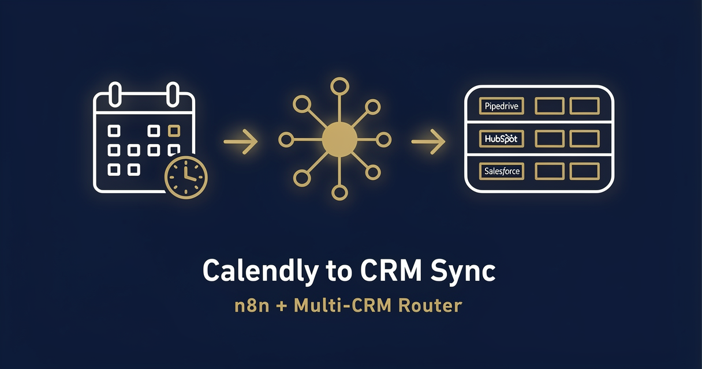

<!-- studiomeyer-mcp-stack-banner:start -->
> **Part of the [StudioMeyer MCP Stack](https://studiomeyer.io)**, Built in Mallorca · ⭐ if you use it
<!-- studiomeyer-mcp-stack-banner:end -->

# Calendly to CRM Sync (Pipedrive / HubSpot / Salesforce)

> Calendly fires `invitee.created` or `invitee.canceled`, the workflow normalizes the payload, classifies the booking by event type, and creates / updates a deal in the configured CRM. With Calendly v2 HMAC verification, idempotency on `event_uri`, rate limit, and graceful error fallback.



## What this does

A Calendly account fires a webhook on every booking event (`invitee.created`, `invitee.canceled`, `invitee.no_show`) to the n8n webhook URL. The workflow verifies the Calendly v2 HMAC signature, normalizes the nested `payload.invitee` and `payload.event` shapes into a stable schema, picks a CRM stage based on event type and lifecycle (booked vs canceled), and either creates a new deal or updates an existing one in Pipedrive (default), HubSpot, or Salesforce. Slack ops channel gets a one-line confirmation.

The result is a router that turns booked meetings into qualified pipeline records and recovers cleanly when a guest cancels (deal moved to a Lost stage with reason logged). The four production patterns mean Calendly retries do not duplicate deals and a leaked webhook URL does not let an attacker spike your CRM.

## Architecture

```
[Calendly Webhook]                   <- rawBody for HMAC v2
    |
    v
[Verify Webhook (opt-in)]            <- CALENDLY_SIGNING_SECRET + WEBHOOK_INTEGRITY_CHECK_ENABLED=1
    |
    v
[Rate Limit (opt-in)]                <- RATE_LIMIT_ENABLED=1, 60 req / 5 min / IP
    |
    v
[Idempotency Check (opt-in)]         <- IDEMPOTENCY_ENABLED=1, dedup on event.uri
    |
    v
[Normalize Payload]                  <- maps Calendly v2 nested shape into stable schema
    |
    v
[Classify Event]                     <- booked / canceled / no_show, picks stage_id
    |
    v
[Set CRM Target]                     <- reads CRM_TARGET env (pipedrive default)
    |
    v
[Route by CRM] -------------------+
    |-- pipedrive  -> [Pipedrive Upsert Deal]    onError -+
    |-- hubspot    -> [HubSpot Upsert Deal]      onError -|
    |-- salesforce -> [Salesforce Upsert Deal]   onError -|
                              |                           |
                              v                           v
                     [Normalize CRM Output]      [Error Fallback]
                              |                           |
                              v                           v
                     [Slack Ops Notification]    [Error Slack Alert]
                              |                           |
                              v                           v
                     [Respond to Calendly]       [Error Respond to Calendly]
```

## Setup

1. **Import this workflow.** Top-right menu in n8n, Import from clipboard, paste the contents of `workflow.json`.
2. **Activate the webhook** in n8n. Copy the production webhook URL.
3. **Create the Calendly v2 webhook subscription.** Use the Calendly v2 API or the Webhook Subscriptions UI under your organization settings. Subscribe to `invitee.created`, `invitee.canceled`, optionally `invitee.no_show`. Set the `signing_key` to a strong random string and store it as `CALENDLY_SIGNING_SECRET` in your n8n env.
4. **Set `CRM_TARGET`** to one of `pipedrive` (default), `hubspot`, `salesforce`.
5. **Set CRM stage IDs** in your env: `CRM_PIPELINE_BOOKED_ID`, `CRM_PIPELINE_CANCELED_ID`. These are the pipeline stage IDs in your CRM where booked / canceled deals should land.
6. **Set `SLACK_OPS_WEBHOOK`** to your Slack incoming-webhook URL for ops notifications.
7. **Add CRM credentials** in n8n's credential store. Pipedrive API token, or HubSpot OAuth, or Salesforce OAuth.
8. **Production patterns (recommended for production):** set `WEBHOOK_INTEGRITY_CHECK_ENABLED=1`, `RATE_LIMIT_ENABLED=1`, `IDEMPOTENCY_ENABLED=1`. The HMAC signing secret was already set in step 3.
9. **Test.** Send a sample payload from `examples/calendly-invitee-created.json` via curl, check the CRM for the new deal.

### Calendly v2 webhook signing reference

Calendly v2 signs every webhook with the `Calendly-Webhook-Signature` header in the format `t=<timestamp>,v1=<hmac-sha256-of-(timestamp.body)>`. The verification node in this template parses that format, checks the timestamp is within a 5-minute replay window, and then `crypto.timingSafeEqual` compares against the recomputed HMAC.

## Extending

**Multi-event-type routing.** Calendly events have a `name` field (event type slug). Branch on event name after `Normalize Payload` to push a Sales-Discovery booking into a different pipeline than a Customer-Success booking.

**Calendar conflict cross-check.** Before upserting the deal, call out to the assigned rep's Google Calendar (HTTP Request with OAuth) and confirm the booking does not collide with an existing internal meeting. If it does, post a Slack DM to the rep with both events.

**Lead enrichment on first booking.** After `Normalize Payload`, if this is the invitee's first booking (Pipedrive person lookup returns empty), fire a Clearbit / Apollo HTTP Request to fill company size, industry, tech stack. Feed those fields into the deal as custom properties.

**No-show handling.** Subscribe to `invitee.no_show` (added to Calendly in 2024). Branch the workflow into a follow-up automation (email-sequence trigger, CRM stage move to Re-engagement, optional Slack DM to the assigned rep).

## Cost notes

| Component | Cost (Stand 2026-05) | Per-execution cost |
|---|---|---|
| **n8n** (self-hosted) | free | $0 |
| **n8n Cloud** | from $20/mo | included |
| **Calendly** (any plan with API) | from $10/user/mo | included |
| **Pipedrive API** | included in plan | free up to your plan limit |
| **HubSpot API** | included in plan | free up to your plan limit |
| **Salesforce API** | varies | varies |
| **Slack incoming webhooks** | free | $0 |

Per-execution cost: **$0**. The workflow makes one CRM API call + one Slack call. Both are free within standard plan limits.

**Worked example at 200 bookings / month:** $0 in template-direct costs (you already pay for n8n, Calendly, and your CRM regardless).

## Common gotchas

- **Calendly signature header is `Calendly-Webhook-Signature`, not `X-Calendly-Signature`.** Easy to miss in third-party docs. The verification node in this template uses the correct header name.
- **The signature payload is `timestamp.body`, not just body.** Calendly prepends the timestamp with a literal dot before computing the HMAC. Forgetting the dot makes verification silently fail.
- **CRM stage IDs are environment-specific.** A Pipedrive sandbox has different stage IDs than production. Always pull the IDs from the CRM you are targeting and set them in env vars, never hardcode.
- **Calendly v2 retries on 5xx for up to 24 hours.** Without idempotency, a transient downtime spike can produce dozens of duplicate deals once your workflow recovers. The `Idempotency Check` node uses `event.uri` (a stable Calendly identifier) as the dedup key.
- **n8n core HTTP request body shape.** The HTTP Request node's body parameter expects a string when you send JSON, not a JSON object. Wrap with `JSON.stringify({...})` in expressions.
- **n8n error syntax.** Inline error pin uses `{{ $json.error.message }}`. Separate Error Trigger Workflow uses `{{ $json.execution.error.message }}` + `{{ $json.workflow.name }}`. Often-quoted `{{ $error.message }}` does not exist.

## Production patterns

Four patterns ship as actual nodes in `workflow.json`. Three opt-in via env vars and one always-on error branch.

**Idempotency** (opt-in, `IDEMPOTENCY_ENABLED=1`). The `Idempotency Check` Code node holds a 5-minute in-memory window of seen `event.uri` values via `$getWorkflowStaticData('global')`. Calendly retries on 5xx for up to 24 hours, but a 5-minute window catches the storm of retries that follow a recovery and the longer-tail late retries usually arrive after the first successful processing. For clustered n8n, swap to Redis `SET NX EX 300`. Snippet in the node's comments.

**Rate limiting** (opt-in, `RATE_LIMIT_ENABLED=1`). Per-IP sliding window, 60 requests / 5 min / IP, bounded at 5000 entries. Defense-in-depth, not the primary control. For real production loads put rate limiting on a reverse proxy (Nginx `limit_req_zone`, Cloudflare WAF, Traefik).

**Webhook HMAC verification** (opt-in, `CALENDLY_SIGNING_SECRET` + `WEBHOOK_INTEGRITY_CHECK_ENABLED=1`). Calendly v2 specific: header is `Calendly-Webhook-Signature`, format is `t=<timestamp>,v1=<hmac>`, payload is `timestamp.body`. The verifier parses the format, checks the timestamp against a 5-minute replay window, then `crypto.timingSafeEqual` compares the v1 HMAC against the recomputed one. Length-guard before the timing-safe compare prevents `RangeError` DoS.

**Error branches** (always on). All three CRM HTTP Request nodes plus the Slack Ops Notification have `On Error: Continue (Using Error Output)` enabled. The error pin lands at `Error Fallback` which builds a structured error log with event URI, target, error message, and feeds two destinations: `Error Slack Alert` (so ops sees the failure) and `Error Respond to Calendly` (so Calendly sees a 200 instead of triggering a retry storm).

## Hard compatibility floor

**Minimum n8n version with CVE-2026-27493 fix:** >= 2.9.3 (stable channel) / >= 2.10.1 (latest / beta channel) / >= 1.123.22 (1.x LTS). CVE-2026-27493 is an unauthenticated RCE in Form nodes (CVSS 9.5). This template does not use Form nodes itself (it uses a Webhook node), but you should still upgrade for general security.

**Self-hosted Node builtins:** the `Verify Webhook` Code node uses `require('crypto')`. Set `NODE_FUNCTION_ALLOW_BUILTIN=crypto` in your n8n env. n8n Cloud has this allowed by default for hosted plans, verify in your tenant.

## Tech stack matrix

| Component | Version | Cost | Free tier | Required when |
|---|---|---|---|---|
| n8n | >= 2.10.1 (CVE-2026-27493 floor) | self-hosted free / Cloud $20/mo | n8n Cloud trial | always |
| Calendly | API v2 | from $10/user/mo | Standard plan | always |
| Pipedrive | API token | included in plan | Pipedrive Essential | CRM_TARGET=pipedrive |
| HubSpot | OAuth | included in plan | HubSpot Free CRM | CRM_TARGET=hubspot |
| Salesforce | OAuth | varies by plan | Developer Edition | CRM_TARGET=salesforce |
| Slack | incoming webhook | free | always | always (ops channel) |

## Credentials checklist

Before activation, create these credentials in n8n:

- [ ] **Calendly Webhook Signing Secret.** Set `CALENDLY_SIGNING_SECRET` to the same secret you configured in the Calendly v2 webhook subscription. Set `WEBHOOK_INTEGRITY_CHECK_ENABLED=1`.
- [ ] **Pipedrive API** (`pipedriveApi`) OR **HubSpot OAuth** (`hubspotApi`) OR **Salesforce OAuth** (`salesforceApi`). Get tokens from your CRM admin panel.
- [ ] **Slack incoming webhook URL** in `SLACK_OPS_WEBHOOK` env var. Create at api.slack.com, App, Incoming Webhooks.

## Need cross-session memory?

This template treats each booking as independent. If you want to recognize returning invitees (the same email books three times over six months, the workflow recognizes them and updates an existing deal with relationship history), see the sister [studiomeyer-io/n8n-templates](https://github.com/studiomeyer-io/n8n-templates) repo. Specifically Template 02 (Customer Support with History) shows the entity-search-then-decide pattern that applies one-to-one to bookings.

## Related templates

- [01 - Form to CRM Lead Router](../01-form-to-crm-lead-router/) · same multi-CRM Switch pattern with a different trigger
- [07 - GitHub Issues to Linear / Jira / ClickUp Router](../07-github-issues-to-tracker/) · same multi-target router with HMAC-verified webhook
- [02 - Stripe Lifecycle to Slack](../02-stripe-lifecycle-to-slack/) · related Slack notification pattern

---

*Built by [StudioMeyer](https://studiomeyer.io) in Mallorca. Issues + ideas at [github.com/studiomeyer-io/n8n-workflows/issues](https://github.com/studiomeyer-io/n8n-workflows/issues).*
