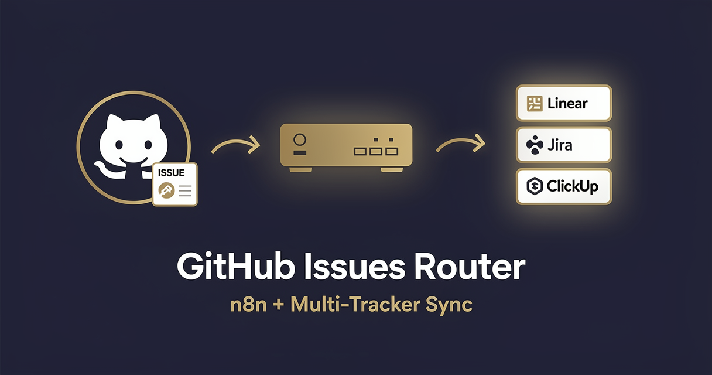

<!-- studiomeyer-mcp-stack-banner:start -->
> **Part of the [StudioMeyer MCP Stack](https://studiomeyer.io)**, Built in Mallorca · ⭐ if you use it
<!-- studiomeyer-mcp-stack-banner:end -->

# GitHub Issues Router (Linear / Jira / ClickUp)

> GitHub fires `issues.opened` or `issues.reopened`, the workflow verifies `X-Hub-Signature-256`, normalizes the issue payload, classifies by labels (bug / feature / chore), and creates a matching ticket in Linear (default), Jira, or ClickUp. With idempotency on `delivery.id`, rate limit, error fallback.



## What this does

A GitHub repository fires a webhook on every issue event (`opened`, `reopened`, `labeled`, `closed`) to the n8n webhook URL. The workflow verifies the `X-Hub-Signature-256` HMAC, normalizes the GitHub issue payload into a stable schema, classifies the issue type from labels (bug / feature / chore), and creates or updates a corresponding ticket in Linear (default), Jira, or ClickUp. The original GitHub issue gets a follow-up comment with the tracker ticket URL.

The result is a one-way mirror that turns GitHub issues into tracked work items in your team's primary issue tracker without manual triage. The four production patterns mean GitHub redelivery does not duplicate tickets and a leaked webhook secret does not let an attacker spam your tracker.

## Architecture

```
[GitHub Webhook]                     <- rawBody for HMAC SHA256
    |
    v
[Verify Webhook (opt-in)]            <- GITHUB_WEBHOOK_SECRET + WEBHOOK_INTEGRITY_CHECK_ENABLED=1
    |
    v
[Rate Limit (opt-in)]                <- RATE_LIMIT_ENABLED=1, 60 req / 5 min / IP
    |
    v
[Idempotency Check (opt-in)]         <- IDEMPOTENCY_ENABLED=1, dedup on X-GitHub-Delivery
    |
    v
[Skip If Duplicate]   IF gateway on $json.skipped===true
    +---- true ----> [Respond Duplicate]   200 OK + {deduped: true}
    |
    v false (live)
[Filter Event Type]                  <- only forwards issues.opened / reopened / labeled
    |
    v
[Normalize Payload]                  <- GitHub issue shape into stable schema
    |
    v
[Classify by Labels]                 <- bug / feature / chore via label match
    |
    v
[Set Tracker Target]                 <- reads TRACKER_TARGET env (linear default)
    |
    v
[Route by Tracker] ----------------+
    |-- linear   -> [Linear Create Issue]    onError -+
    |-- jira     -> [Jira Create Issue]      onError -|
    |-- clickup  -> [ClickUp Create Task]    onError -|
                              |                       |
                              v                       v
                     [Normalize Tracker Output] [Error Fallback]
                              |                       |
                              v                       v
                     [Comment on GitHub Issue]  [Error Slack Alert]
                              |                       |
                              v                       v
                     [Respond to GitHub]        [Error Respond to GitHub]
```

## Setup

1. **Import this workflow.** Top-right menu in n8n, Import from clipboard, paste the contents of `workflow.json`.
2. **Activate the webhook** in n8n. Copy the production webhook URL.
3. **Create the GitHub webhook.** In your repo settings under Webhooks, paste the n8n webhook URL, set Content type to `application/json`, generate a strong random secret and store it as `GITHUB_WEBHOOK_SECRET` in your n8n env, subscribe to the `Issues` event only.
4. **Set `TRACKER_TARGET`** to one of `linear` (default), `jira`, `clickup`.
5. **Set tracker IDs** in your env: for Linear set `LINEAR_TEAM_ID`, for Jira set `JIRA_PROJECT_KEY` + `JIRA_BASE_URL`, for ClickUp set `CLICKUP_LIST_ID`.
6. **Add tracker credentials** in n8n's credential store. Linear API key, or Jira basic auth (email + API token), or ClickUp personal API token.
7. **Add GitHub credentials** in n8n's credential store (`githubApi` PAT with `repo:read` + `issues:write` scopes) so the workflow can comment back on the original issue.
8. **Production patterns (recommended for production):** set `WEBHOOK_INTEGRITY_CHECK_ENABLED=1`, `RATE_LIMIT_ENABLED=1`, `IDEMPOTENCY_ENABLED=1`. The HMAC signing secret was already set in step 3.
9. **Test.** Open a test issue in your repo, watch the workflow execute, verify the tracker ticket appears and the GitHub issue gets a follow-up comment.

### GitHub webhook signing reference

GitHub signs every webhook with the `X-Hub-Signature-256` header in the format `sha256=<hex-hmac>`. The HMAC is computed over the raw request body using your configured secret. The verification node strips the `sha256=` prefix and `crypto.timingSafeEqual` compares the recomputed HMAC.

GitHub also sends `X-GitHub-Delivery` (a UUID per delivery) which is the perfect idempotency key. GitHub redelivers within 5 minutes on 5xx response, then backs off; the 5-minute in-memory window catches the storm.

## Extending

**Bidirectional sync.** When the tracker ticket is closed (Linear webhook, Jira webhook, ClickUp task event), close the original GitHub issue with a final comment. Add a second webhook trigger to this same workflow or build a sister workflow.

**Auto-assignment by label.** After `Classify by Labels`, route bug-typed issues to a specific Linear assignee or Jira component lead. Read the assignee map from an env JSON or a Postgres lookup.

**Severity escalation.** If the issue body contains `severity: critical` or has the `incident` label, additionally post to a `#oncall` Slack channel and create a PagerDuty incident via the PagerDuty Events API. Branch in parallel to the tracker create.

**Project field mapping.** Linear uses team + project IDs, Jira uses project keys + epic links, ClickUp uses lists + folders. After `Set Tracker Target`, read a per-target mapping from an env JSON like `TRACKER_FIELD_MAP_LINEAR` to pick the correct project and assign labels into native tracker fields.

## Cost notes

| Component | Cost (Stand 2026-05) | Per-execution cost |
|---|---|---|
| **n8n** (self-hosted) | free | $0 |
| **n8n Cloud** | from $20/mo | included |
| **GitHub** | free for public repos / from $4/user/mo | included |
| **Linear** | from $8/user/mo | included |
| **Jira** | from $7.53/user/mo | included |
| **ClickUp** | from $7/user/mo | included |

Per-execution cost: **$0**. The workflow makes one tracker API call + one GitHub comment call. Both are free within standard plan limits.

**Worked example at 200 issues / month:** $0 in template-direct costs (you already pay for n8n, GitHub, and your tracker regardless).

## Common gotchas

- **GitHub uses SHA-256, not SHA-1.** GitHub still sends the legacy `X-Hub-Signature` (SHA-1) header for backward compatibility. Always use `X-Hub-Signature-256`. The verification node only checks the SHA-256 header.
- **Signature has the `sha256=` prefix.** Forgetting to strip it makes verification silently fail. The template strips correctly.
- **n8n core HTTP request body shape.** The HTTP Request node's body parameter expects a string when you send JSON, not a JSON object. Wrap with `JSON.stringify({...})` in expressions.
- **Linear's API uses GraphQL, not REST.** This template uses Linear's GraphQL endpoint with the `issueCreate` mutation. Switching to a different field selection requires editing the query string in the Linear node.
- **Jira Cloud and Jira Server have different base URLs.** The template defaults to `JIRA_BASE_URL=https://your-company.atlassian.net`. For self-hosted Jira Server adjust the path under `/rest/api/2/issue`.
- **n8n error syntax.** Inline error pin uses `{{ $json.error.message }}`. Separate Error Trigger Workflow uses `{{ $json.execution.error.message }}` + `{{ $json.workflow.name }}`. Often-quoted `{{ $error.message }}` does not exist.

## Production patterns

Four patterns ship as actual nodes in `workflow.json`. Three opt-in via env vars and one always-on error branch.

**Idempotency** (opt-in, `IDEMPOTENCY_ENABLED=1`). The `Idempotency Check` Code node holds a 5-minute in-memory window of seen `X-GitHub-Delivery` UUIDs via `$getWorkflowStaticData('global')`. GitHub redelivers within 5 minutes on 5xx; the in-memory window catches the retry storm. On a duplicate the Idempotency Check emits a `{ skipped: true, reason: 'duplicate' }` sentinel that the `Skip If Duplicate` IF node routes to a dedicated `Respond Duplicate` `respondToWebhook` node returning 200 OK + `{ ok: true, deduped: true }`. Without that gateway, an `responseMode: responseNode` webhook would hold the connection open for 30 seconds on every duplicate and the source provider would log delivery failed. For clustered n8n, swap to Redis `SET NX EX 300`. Snippet in the node's comments.

**Rate limiting** (opt-in, `RATE_LIMIT_ENABLED=1`). Per-IP sliding window, 60 requests / 5 min / IP, bounded at 5000 entries with eviction. GitHub's webhook source IPs are documented and stable, so per-IP limiting is effective.

**Webhook HMAC verification** (opt-in, `GITHUB_WEBHOOK_SECRET` + `WEBHOOK_INTEGRITY_CHECK_ENABLED=1`). HMAC-SHA256 of raw body compared against the `sha256=<hex>` portion of `X-Hub-Signature-256` with `crypto.timingSafeEqual`. Length-guard before the timing-safe compare prevents `RangeError` DoS from a 1-char signature.

**Error branches** (always on). All three tracker HTTP Request nodes plus the GitHub Comment have `On Error: Continue (Using Error Output)` enabled. The error pin lands at `Error Fallback` which builds a structured error log with delivery ID, target, error message, and feeds two destinations: `Error Slack Alert` and `Error Respond to GitHub` (so GitHub sees a 200 instead of triggering a retry storm).

## Hard compatibility floor

**Minimum n8n version with CVE-2026-27493 fix:** >= 2.9.3 (stable channel) / >= 2.10.1 (latest / beta channel) / >= 1.123.22 (1.x LTS). CVE-2026-27493 is an unauthenticated RCE in Form nodes (CVSS 9.5). This template does not use Form nodes itself, but you should still upgrade for general security.

**Self-hosted Node builtins:** the `Verify Webhook` Code node uses `require('crypto')`. Set `NODE_FUNCTION_ALLOW_BUILTIN=crypto` in your n8n env. n8n Cloud has this allowed by default for hosted plans, verify in your tenant.

## Tech stack matrix

| Component | Version | Cost | Free tier | Required when |
|---|---|---|---|---|
| n8n | >= 2.10.1 (CVE-2026-27493 floor) | self-hosted free / Cloud $20/mo | n8n Cloud trial | always |
| GitHub | webhooks v2 | free for public / from $4/user/mo | always | always |
| Linear | API key | from $8/user/mo | Free plan | TRACKER_TARGET=linear |
| Jira | API token | from $7.53/user/mo | Free plan up to 10 users | TRACKER_TARGET=jira |
| ClickUp | personal API token | from $7/user/mo | Free Forever plan | TRACKER_TARGET=clickup |
| Slack (for error alerts) | incoming webhook | free | always | always |

## Credentials checklist

Before activation, create these credentials in n8n:

- [ ] **GitHub Webhook Signing Secret.** Set `GITHUB_WEBHOOK_SECRET` to the same secret you configured in the GitHub repo webhook settings. Set `WEBHOOK_INTEGRITY_CHECK_ENABLED=1`.
- [ ] **GitHub PAT** (`githubApi`) for commenting back on the issue. Scopes: `repo` (or `public_repo` if only public).
- [ ] **Linear API** (`linearApi`) OR **Jira basic auth** (`httpBasicAuth` with email + API token) OR **ClickUp PAT** (header `Authorization: pk_*`). Generate per provider.
- [ ] **Slack incoming webhook URL** in `SLACK_OPS_WEBHOOK` env var for error alerts.

## Need cross-session memory?

This template treats each issue as independent. If you want to recognize recurring reporters or correlate issues across multiple repos for a single customer, see the sister [studiomeyer-io/n8n-templates](https://github.com/studiomeyer-io/n8n-templates) repo. Specifically Template 02 (Customer Support with History) shows the entity-search-then-decide pattern that maps one-to-one onto issue triage.

## Related templates

- [01 - Form to CRM Lead Router](../01-form-to-crm-lead-router/) · same multi-target Switch pattern with form trigger
- [06 - Calendly to CRM Sync](../06-calendly-to-crm-sync/) · same multi-target router with HMAC-verified webhook
- [02 - Stripe Lifecycle to Slack](../02-stripe-lifecycle-to-slack/) · related Slack notification pattern

---

*Built by [StudioMeyer](https://studiomeyer.io) in Mallorca. Issues + ideas at [github.com/studiomeyer-io/n8n-workflows/issues](https://github.com/studiomeyer-io/n8n-workflows/issues).*
