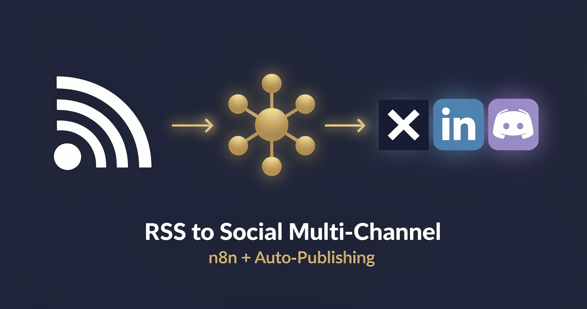

<!-- studiomeyer-mcp-stack-banner:start -->
> **Part of the [StudioMeyer MCP Stack](https://studiomeyer.io)**, Built in Mallorca · ⭐ if you use it
<!-- studiomeyer-mcp-stack-banner:end -->

# RSS Feed to Multi-Channel Social (X / LinkedIn / Discord)

> Schedule trigger fetches one or more RSS feeds, the workflow dedups against an in-memory window of seen guids, formats per-channel posts (X 280 chars, LinkedIn longer-form, Discord embed), and posts via the configured social channels in parallel. With idempotency on guid, rate limit, error fallback per channel.



## What this does

A schedule trigger (default every 30 minutes) fires, the workflow fetches each configured RSS feed (`RSS_FEEDS` env, comma-separated URLs), filters out items it has already published via a 7-day in-memory window of seen guids, formats a per-channel post for each enabled social channel (X / LinkedIn / Discord), and POSTs in parallel. Each channel has its own error branch so a Twitter API blip does not break the LinkedIn post.

The result is a one-process feed-to-multi-channel publisher that never double-posts and survives partial outages. The four production patterns mean the workflow can run unattended at high frequency without flooding any single channel.

## Architecture

```
[Schedule Trigger]                   <- every 30 min default
    |
    v
[List Feeds]                         <- splits RSS_FEEDS env into one item per URL
    |
    v
[Rate Limit (opt-in)]                <- RATE_LIMIT_ENABLED=1, per-feed-host throttle (BEFORE the fetch)
    |
    v
[Fetch RSS Feed]                     <- HTTP Request per URL (rate-limited above)
    |
    v
[Parse RSS Items]                    <- quote-aware RSS / Atom parser
    |
    v
[Idempotency Filter]                 <- IDEMPOTENCY_ENABLED=1, dedup on item.guid (7-day window)
    |
    v
[Normalize Items]                    <- map RSS shape into stable schema
    |
    v
[Set Channel Targets]                <- reads SOCIAL_CHANNELS env (csv: x,linkedin,discord)
    |
    v
[Route by Channel] -----------------+
    |-- x         -> [X Post]            onError -+
    |-- linkedin  -> [LinkedIn Post]     onError -|
    |-- discord   -> [Discord Webhook]   onError -|
                              |                   |
                              v                   v
                     [Aggregate Results]   [Error Fallback]
                              |                   |
                              v                   v
                     [Slack Summary]       [Error Slack Alert]
```

## Setup

1. **Import this workflow.** Top-right menu in n8n, Import from clipboard, paste the contents of `workflow.json`.
2. **Set `RSS_FEEDS`** to a comma-separated list of feed URLs in your n8n env, e.g. `https://news.ycombinator.com/rss,https://feeds.feedburner.com/TechCrunch`.
3. **Set `SOCIAL_CHANNELS`** to a comma-separated list of channels you want enabled, e.g. `x,linkedin,discord`. Channels not listed are skipped.
4. **Add credentials per channel:**
   - X (Twitter): create an app at developer.x.com, generate an OAuth 1.0a key + secret + token pair, store as `twitterOAuth1Api` credential.
   - LinkedIn: register an app at linkedin.com/developers, request the `w_member_social` scope, store the OAuth 2.0 token as `linkedInOAuth2Api`.
   - Discord: create a webhook in your channel settings, set `DISCORD_WEBHOOK_URL` env var (no app needed).
5. **Set `SLACK_OPS_WEBHOOK`** for ops summary + error notifications.
6. **Adjust schedule** in the Schedule Trigger node. Default is every 30 minutes. Heavy feeds may want every 5 minutes; low-volume feeds every hour.
7. **Production patterns (recommended):** `RATE_LIMIT_ENABLED=1`, `IDEMPOTENCY_ENABLED=1`. No HMAC needed because the trigger is internal cron, not a public webhook.
8. **Test.** Activate the workflow, wait one cycle, verify at most a couple of posts go out (the first run may post recent items unless you seed the dedup window).

### Seeding the dedup window

On first activation the in-memory window is empty so every item in the feed looks new. To avoid a 50-post burst, either disable channels for the first cycle or pre-fetch the feeds with `IDEMPOTENCY_ENABLED=1` and the channels disabled (so guids get logged without posting).

## Extending

**Per-feed routing.** Add a Code node after `Normalize Items` that branches by feed URL. Tech feeds go to X + Discord, business feeds to LinkedIn only. Read the per-feed routing map from `RSS_FEED_ROUTING_JSON` env.

**LLM-rewrite per channel.** Insert an OpenAI / Anthropic node before each channel post that rewrites the title + summary into channel-native voice. X gets witty short, LinkedIn gets professional longer, Discord gets community casual. Pricing notes on cost per execution should stay aware of LLM token counts.

**Author + tag enrichment.** If the feed includes `dc:creator` or `category` fields, surface them in the post template. For X, add `via @<author>` if the author's handle is in a lookup. For LinkedIn, add hashtags from categories.

**Bluesky + Mastodon channels.** Same Switch + HTTP Request pattern. Bluesky uses ATProto (HTTP POST + JWT), Mastodon uses standard OAuth + `/api/v1/statuses`. Add two more outputKeys to the Route node.

## Cost notes

| Component | Cost (Stand 2026-05) | Per-execution cost |
|---|---|---|
| **n8n** (self-hosted) | free | $0 |
| **n8n Cloud** | from $20/mo | included |
| **X (Twitter) API** | pay-per-use default (~$0.01 per post) since Feb 2026 / legacy Basic $200/mo for existing subscribers | included |
| **LinkedIn API** | free for OAuth posting | $0 |
| **Discord webhook** | free | $0 |

Per-execution cost: **$0** for LinkedIn + Discord + Slack. X moved to pay-per-use as the default for new signups in February 2026 (~$0.01 per post creation). Existing subscribers stayed on the legacy Basic plan at $200/mo (doubled from $100/mo in January 2025). The free tier is read-only.

**Worked example at 30 posts / day across 3 channels:** $0 in template-direct costs above the X subscription floor.

## Common gotchas

- **X (Twitter) API write access is paid since 2024.** As of February 2026 the default for new signups is pay-per-use credits (~$0.01 per post creation, ~$0.005 per read). Legacy Basic plan ($200/mo, doubled from $100/mo in January 2025) is grandfathered for existing subscribers but no longer purchasable by new accounts. The free tier remains read-only.
- **LinkedIn `w_member_social` scope is restricted.** You must apply for it via the LinkedIn Developer Portal product approval flow. Approval is usually fast for individual posting from your own profile.
- **Discord webhook content limit is 2000 chars.** The template truncates at 1900 chars to leave room for the embed footer. Adjust if you embed longer summaries.
- **RSS guid is not always unique.** Some feeds reuse guids on edits. The template uses `item.guid || item.link || hash(title + pubDate)` as the dedup key.
- **n8n core HTTP request body shape.** The HTTP Request node's body parameter expects a string when you send JSON, not a JSON object. Wrap with `JSON.stringify({...})` in expressions.
- **n8n error syntax.** Inline error pin uses `{{ $json.error.message }}`. Separate Error Trigger Workflow uses `{{ $json.execution.error.message }}` + `{{ $json.workflow.name }}`. Often-quoted `{{ $error.message }}` does not exist.

## Production patterns

Three patterns ship as actual nodes in `workflow.json`. Two opt-in via env vars and one always-on error branch. HMAC verification is intentionally not part of this template because the trigger is an internal cron, not a public webhook.

**Idempotency** (opt-in, `IDEMPOTENCY_ENABLED=1`). The `Idempotency Filter` Code node holds a 7-day in-memory window of seen RSS guids via `$getWorkflowStaticData('global')`. The 7-day window covers feeds that occasionally re-publish items. Default-off so the import boots clean and you can see what would be filtered. For clustered n8n, swap to Redis `SET NX EX 604800`. Snippet in the node's comments.

**Rate limiting** (opt-in, `RATE_LIMIT_ENABLED=1`). Per-feed-host sliding window, 12 fetches per hour per host. Defense against accidentally hammering a feed when a misconfigured schedule fires every minute. For real production loads, put rate limiting on a reverse proxy or use the feed source's recommended polling interval.

**Error branches** (always on). Each social channel HTTP Request has `On Error: Continue (Using Error Output)` enabled. The error pin lands at `Error Fallback` which builds a structured error log per failed channel. Other channels keep posting. The Slack summary at the end shows per-channel success / failure counts.

## Hard compatibility floor

**Minimum n8n version with CVE-2026-27493 fix:** >= 2.9.3 (stable channel) / >= 2.10.1 (latest / beta channel) / >= 1.123.22 (1.x LTS). CVE-2026-27493 is an unauthenticated RCE in Form nodes (CVSS 9.5). This template does not use Form nodes itself, but you should still upgrade for general security.

**Self-hosted Node builtins:** the `Idempotency Filter` Code node uses `require('crypto')` for hash-based fallback dedup keys. Set `NODE_FUNCTION_ALLOW_BUILTIN=crypto` in your n8n env. n8n Cloud has this allowed by default.

## Tech stack matrix

| Component | Version | Cost | Free tier | Required when |
|---|---|---|---|---|
| n8n | >= 2.10.1 (CVE-2026-27493 floor) | self-hosted free / Cloud $20/mo | n8n Cloud trial | always |
| RSS feed sources | any RSS 2.0 / Atom feed | free | always | always |
| X (Twitter) write API | OAuth 1.0a | pay-per-use (~$0.01/post, default since Feb 2026) or legacy Basic $200/mo (existing subs) | read-only Free | x in SOCIAL_CHANNELS |
| LinkedIn API | OAuth 2.0 (`w_member_social`) | free | always | linkedin in SOCIAL_CHANNELS |
| Discord webhook | URL only, no auth | free | always | discord in SOCIAL_CHANNELS |
| Slack incoming webhook | URL only, no auth | free | always | always (ops summary) |

## Credentials checklist

Before activation, create these credentials in n8n:

- [ ] **X (Twitter) OAuth 1.0a** (`twitterOAuth1Api`). New signups: register at developer.x.com and load pay-per-use credits (~$0.01 per post, default since Feb 2026). Existing subscribers keep legacy Basic at $200/mo. Required scopes: tweet.write.
- [ ] **LinkedIn OAuth 2.0** (`linkedInOAuth2Api`). Apply at linkedin.com/developers. Scope: `w_member_social`.
- [ ] **Discord Webhook URL** in `DISCORD_WEBHOOK_URL` env var. Generated in Discord channel settings, no app required.
- [ ] **Slack incoming webhook URL** in `SLACK_OPS_WEBHOOK` env var.

## Need cross-session memory?

This template is a good fit for the memory-free Tier 4 layer because RSS items are independent and per-item dedup is enough. If you want richer state (track which feeds drive the most engagement on which channels, build a knowledge graph of authors and topics), see the sister [studiomeyer-io/n8n-templates](https://github.com/studiomeyer-io/n8n-templates) repo.

## Related templates

- [05 - Slack Channel Daily Digest](../05-slack-channel-daily-digest/) · related schedule + multi-output pattern
- [03 - Uptime Monitor with Alerts](../03-uptime-monitor-with-alerts/) · same schedule trigger + Slack alert backbone
- [04 - SSL Certificate Expiry Watcher](../04-ssl-certificate-expiry-watcher/) · another scheduled-cron template

---

*Built by [StudioMeyer](https://studiomeyer.io) in Mallorca. Issues + ideas at [github.com/studiomeyer-io/n8n-workflows/issues](https://github.com/studiomeyer-io/n8n-workflows/issues).*
