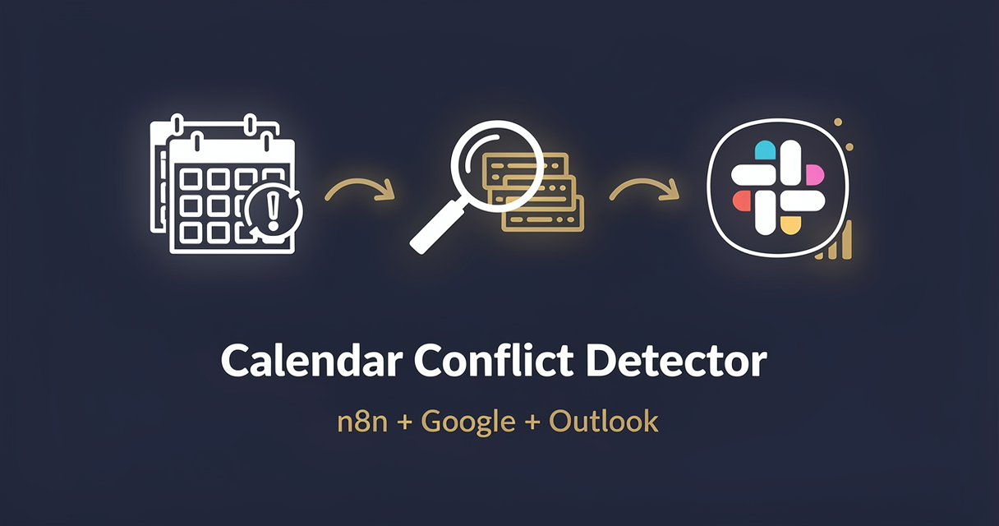

<!-- studiomeyer-mcp-stack-banner:start -->
> **Part of the [StudioMeyer MCP Stack](https://studiomeyer.io)**, Built in Mallorca · ⭐ if you use it
<!-- studiomeyer-mcp-stack-banner:end -->

# Calendar Conflict Detector (Google Calendar / Outlook)

> Schedule trigger fetches the next 7 days of events from Google Calendar (default) or Outlook, runs an interval-overlap algorithm against the configured calendars, and posts a Slack alert per conflict with both event titles, time windows, and direct links. With per-calendar idempotency, rate limit, error fallback.



## What this does

A schedule trigger (default daily at 06:00 UTC) fires, the workflow reads events from each calendar listed in `CALENDAR_IDS` for the next 7 days via the configured provider (`CALENDAR_PROVIDER=google` default or `outlook`), normalizes the per-provider event shape into a stable schema, runs an interval-overlap algorithm against every pair, and posts a per-conflict Slack alert with both events, the overlap window, and direct calendar links. Conflicts already-alerted in the last 24 hours are deduped.

The result is a quiet, reliable conflict detector that surfaces double-bookings before the meeting starts. The four production patterns mean the workflow can run every 30 minutes if you want without spamming Slack on the same conflict.

## Architecture

```
[Schedule Trigger]                   <- daily 06:00 UTC default
    |
    v
[Read Calendar IDs]                  <- splits CALENDAR_IDS env into items
    |
    v
[Rate Limit (opt-in)]                <- RATE_LIMIT_ENABLED=1, per-calendar throttle
    |
    v
[Set Provider]                       <- CALENDAR_PROVIDER env (google default)
    |
    v
[Route by Provider] ---------------+
    |-- google   -> [Google Calendar List]   onError -+
    |-- outlook  -> [Outlook Events List]    onError -|
                              |                       |
                              v                       v
                     [Normalize Events]       [Error Fallback]
                              |                       |
                              v                       v
                     [Detect Overlaps]        [Error Slack Alert]
                              |
                              v
                     [Idempotency Filter]    <- dedup on hash(event A id + B id)
                              |
                              v
                     [Slack Alert per Conflict]
```

## Setup

1. **Import this workflow.** Top-right menu in n8n, Import from clipboard, paste the contents of `workflow.json`.
2. **Set `CALENDAR_PROVIDER`** to `google` (default) or `outlook`.
3. **Set `CALENDAR_IDS`** to a comma-separated list of calendar IDs to monitor. For Google Calendar these are typically email addresses or named calendar IDs; for Outlook they are user UPNs.
4. **Add credentials per provider:**
   - Google Calendar: OAuth2 with scope `https://www.googleapis.com/auth/calendar.readonly`. Stored as `googleCalendarOAuth2Api`.
   - Outlook (Microsoft Graph): OAuth2 with scope `Calendars.Read`. Stored as `microsoftOutlookOAuth2Api`.
5. **Set `SLACK_OPS_WEBHOOK`** for the conflict alerts.
6. **Set `CONFLICT_LOOKAHEAD_DAYS`** if you want a window other than the default 7.
7. **Production patterns (recommended):** `RATE_LIMIT_ENABLED=1`, `IDEMPOTENCY_ENABLED=1`. No HMAC needed (internal cron).
8. **Test.** Activate, run one cycle manually, verify a known conflict triggers a Slack message.

### What counts as a conflict

The algorithm flags any two events on different calendars that have overlapping time windows. Events on the same calendar are skipped (those are the calendar owner's own scheduling decision). All-day events are normalized to their full day window. Tentative / declined events are excluded by default.

## Extending

**Severity tiers.** Tag conflicts as critical (overlap > 30 min during business hours), warning (overlap < 30 min), or informational (overlap outside 09:00 to 18:00). Pass severity into the Slack alert payload to color-code Block Kit messages.

**Auto-resolve via DM.** When a conflict is detected, also DM both calendar owners with a one-click "Reschedule" link that opens Calendly with their availability. Add a Slack-DM HTTP node after the alert.

**Webhook trigger from Calendly cancels.** Wire the [06 - Calendly to CRM Sync](../06-calendly-to-crm-sync/) template's `invitee.canceled` event back to here as an additional trigger so canceled bookings immediately re-check the affected calendar.

**Event recurrence-aware.** Google and Outlook expand recurring events when fetched with the right query parameters. The default query in this template includes recurrence expansion. To skip expansion for a noisier feed, set `EXPAND_RECURRING=0`.

## Cost notes

| Component | Cost (Stand 2026-05) | Per-execution cost |
|---|---|---|
| **n8n** (self-hosted) | free | $0 |
| **n8n Cloud** | from $20/mo | included |
| **Google Calendar API** | free up to 1M queries/day | $0 |
| **Microsoft Graph (Outlook)** | included with M365 license | $0 |
| **Slack incoming webhook** | free | $0 |

Per-execution cost: **$0**. Calendar provider quotas are very generous.

**Worked example at hourly polling across 5 calendars:** 5 × 24 = 120 calendar API calls / day, well under all provider quotas.

## Common gotchas

- **Google Calendar `singleEvents=true` is required for recurrence expansion.** Without it the API returns the parent recurring event only and your overlap algorithm misses individual instances. The template sets `singleEvents=true` and `orderBy=startTime`.
- **Outlook calendarView vs events endpoint.** Use `/calendarView?startDateTime&endDateTime` for time-bounded fetches with recurrence expansion. The `/events` endpoint returns the master recurring event only.
- **Timezone handling.** Google returns ISO-8601 with timezone offsets, Outlook returns ISO-8601 in UTC by default. The Normalize node converts everything to UTC ISO before the overlap check.
- **All-day events.** Google sends `start.date` (no time), Outlook sends `isAllDay: true`. The Normalize node converts both to a full-day window in the calendar's timezone (or UTC fallback).
- **Tentative / canceled events.** The template excludes events with `status: cancelled` (Google) or `showAs: free` (Outlook). Adjust the filter in the Normalize node if you want to include them.
- **n8n core HTTP request body shape.** The HTTP Request node's body parameter expects a string when you send JSON, not a JSON object. Wrap with `JSON.stringify({...})` in expressions.
- **n8n error syntax.** Inline error pin uses `{{ $json.error.message }}`. Separate Error Trigger Workflow uses `{{ $json.execution.error.message }}` + `{{ $json.workflow.name }}`. Often-quoted `{{ $error.message }}` does not exist.

## Production patterns

Three patterns ship as actual nodes in `workflow.json`. Two opt-in via env vars and one always-on error branch. HMAC verification is intentionally not part of this template because the trigger is an internal cron.

**Idempotency** (opt-in, `IDEMPOTENCY_ENABLED=1`). The `Idempotency Filter` Code node holds a 24-hour in-memory window of seen conflict-pair hashes (`sha256(eventA.id + ':' + eventB.id)`) via `$getWorkflowStaticData('global')`. The 24-hour window prevents the same conflict from spamming Slack on every cycle while still re-alerting if the conflict persists into the next day. For clustered n8n, swap to Redis `SET NX EX 86400`. Snippet in the node's comments.

**Rate limiting** (opt-in, `RATE_LIMIT_ENABLED=1`). Per-calendar-ID sliding window, 60 fetches per hour per calendar, bounded at 200 entries. Defense against an over-aggressive schedule.

**Error branches** (always on). Both calendar provider HTTP Request nodes have `On Error: Continue (Using Error Output)` enabled. The error pin lands at `Error Fallback` which builds a structured error log per failed calendar fetch and posts a one-line Slack alert. One calendar failing does not stop overlap detection on the others.

## Hard compatibility floor

**Minimum n8n version with CVE-2026-27493 fix:** >= 2.9.3 (stable channel) / >= 2.10.1 (latest / beta channel) / >= 1.123.22 (1.x LTS). CVE-2026-27493 is an unauthenticated RCE in Form nodes (CVSS 9.5). This template does not use Form nodes, but you should still upgrade for general security.

**Self-hosted Node builtins:** the `Idempotency Filter` Code node uses `require('crypto')`. Set `NODE_FUNCTION_ALLOW_BUILTIN=crypto` in your n8n env. n8n Cloud has this allowed by default.

## Tech stack matrix

| Component | Version | Cost | Free tier | Required when |
|---|---|---|---|---|
| n8n | >= 2.10.1 (CVE-2026-27493 floor) | self-hosted free / Cloud $20/mo | n8n Cloud trial | always |
| Google Calendar API | v3 | free | 1M queries/day | CALENDAR_PROVIDER=google |
| Microsoft Graph (Outlook) | v1.0 | included with M365 | 10k/min throttle | CALENDAR_PROVIDER=outlook |
| Slack incoming webhook | URL only, no auth | free | always | always (alert channel) |

## Credentials checklist

Before activation, create these credentials in n8n:

- [ ] **Google Calendar OAuth2** (`googleCalendarOAuth2Api`) with scope `calendar.readonly`. OR **Microsoft Graph OAuth2** (`microsoftOutlookOAuth2Api`) with scope `Calendars.Read`.
- [ ] **Slack incoming webhook URL** in `SLACK_OPS_WEBHOOK` env var.

## Need cross-session memory?

This template's idempotency window is enough for typical use. If you want richer state (track which colleagues have the most recurring conflicts, build a knowledge graph of meeting patterns), see the sister [studiomeyer-io/n8n-templates](https://github.com/studiomeyer-io/n8n-templates) repo.

## Related templates

- [03 - Uptime Monitor with Alerts](../03-uptime-monitor-with-alerts/) · same schedule trigger + Slack alert backbone
- [04 - SSL Certificate Expiry Watcher](../04-ssl-certificate-expiry-watcher/) · another scheduled-cron template with severity-coded alerts
- [06 - Calendly to CRM Sync](../06-calendly-to-crm-sync/) · upstream booking template that can feed cancels into this detector

---

*Built by [StudioMeyer](https://studiomeyer.io) in Mallorca. Issues + ideas at [github.com/studiomeyer-io/n8n-workflows/issues](https://github.com/studiomeyer-io/n8n-workflows/issues).*
