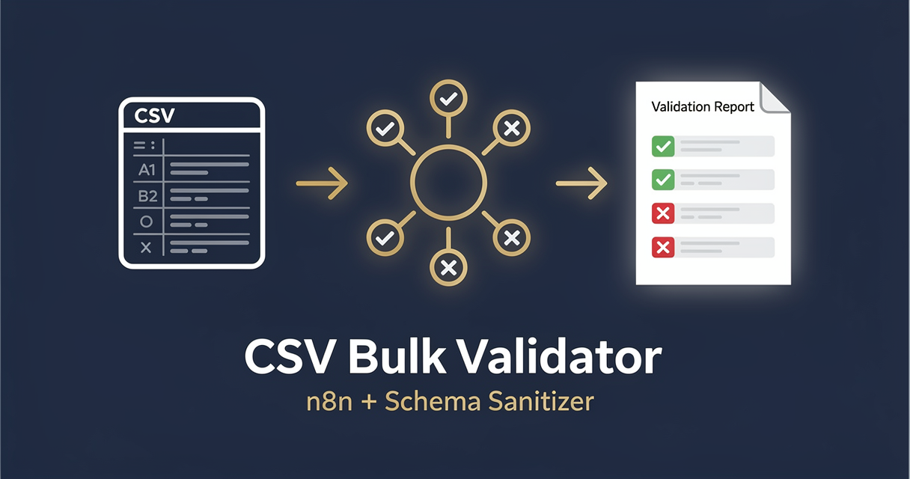

<!-- studiomeyer-mcp-stack-banner:start -->
> **Part of the [StudioMeyer MCP Stack](https://studiomeyer.io)**, Built in Mallorca · ⭐ if you use it
<!-- studiomeyer-mcp-stack-banner:end -->

# CSV Bulk Validator + Sanitizer

> Webhook accepts a CSV (multipart upload or raw POST), the workflow parses and validates each row against a configurable JSON schema, sanitizes string fields (trim, escape, normalize), separates valid from invalid rows, returns a structured per-row report, and optionally posts a Slack summary. With HMAC verification, idempotency, rate limit, error fallback.



## What this does

A client POSTs a CSV (either as raw `text/csv` body or as a multipart `file` field) to the webhook. The workflow parses the CSV with quote-aware splitting (handles commas inside quoted fields, escaped quotes), validates each row against a `VALIDATION_SCHEMA` env JSON (required fields, type coercion, regex patterns, max-length), sanitizes string fields (trim, collapse whitespace, strip control chars, optional HTML escape), separates valid from invalid rows, and returns a structured per-row report `{valid: [...], invalid: [{row, errors}], summary: {...}}`. Optionally posts a Slack summary with valid / invalid counts.

The result is a one-call CSV onboarding gate that catches malformed data before it hits your downstream system. The four production patterns mean an attacker cannot DoS the validator with a 1 GB upload or replay the same submission.

## Architecture

```
[Webhook (file upload)]              <- multipart or raw text/csv, rawBody for HMAC
    |
    v
[Verify Webhook (opt-in)]            <- CSV_UPLOAD_SIGNING_SECRET + WEBHOOK_INTEGRITY_CHECK_ENABLED=1
    |
    v
[Rate Limit (opt-in)]                <- RATE_LIMIT_ENABLED=1, 60 req / 5 min / IP
    |
    v
[Idempotency Check (opt-in)]         <- IDEMPOTENCY_ENABLED=1, dedup on hash(rawBody)
    |
    v
[Skip If Duplicate]   IF gateway on $json.skipped===true
    +---- true ----> [Respond Duplicate]   200 OK + {deduped: true}
    |
    v false (live)
[Parse CSV]                          <- quote-aware split, header row detection
    |
    v
[Validate + Sanitize Rows]           <- schema check from VALIDATION_SCHEMA env
    |
    v
[Build Report]                       <- {valid, invalid, summary}
    |
    v
[Slack Summary]                      onError -> Error Fallback
    |
    v
[Respond to Client]                  <- 200 with structured report
```

## Setup

1. **Import this workflow.** Top-right menu in n8n, Import from clipboard, paste the contents of `workflow.json`.
2. **Activate the webhook** in n8n. Copy the production webhook URL.
3. **Set `VALIDATION_SCHEMA`** in your n8n env. JSON object describing required columns, types, patterns, max-length, optional default values. Example below.
4. **Set `MAX_ROWS`** if you want to limit accepted CSV size (default 10000).
5. **Set `MAX_BODY_BYTES`** to cap upload size (default 5MB; n8n itself has a separate body-size limit you may also need to tune).
6. **Set `SLACK_OPS_WEBHOOK`** if you want a per-batch summary posted to Slack.
7. **Production patterns (recommended for production):** set `WEBHOOK_INTEGRITY_CHECK_ENABLED=1`, `CSV_UPLOAD_SIGNING_SECRET=<32-char-random>` and have your client sign requests with `x-csv-signature: <hmac-sha256(rawBody)>` header. Set `RATE_LIMIT_ENABLED=1`, `IDEMPOTENCY_ENABLED=1`.
8. **Test.** POST a CSV from `examples/csv-sample.csv` via curl, inspect the JSON response.

### Example `VALIDATION_SCHEMA`

```json
{
  "columns": [
    { "name": "email", "required": true, "type": "string", "pattern": "^[^@]+@[^@]+\\.[^@]+$", "maxLength": 254 },
    { "name": "first_name", "required": true, "type": "string", "minLength": 1, "maxLength": 100 },
    { "name": "age", "required": false, "type": "integer", "min": 0, "max": 150 },
    { "name": "country", "required": false, "type": "string", "enum": ["DE", "AT", "CH", "ES", "US", "UK"] }
  ]
}
```

### Example curl (without HMAC)

```bash
curl -X POST https://your-n8n.example.com/webhook/csv-validate \
  -H "Content-Type: text/csv" \
  --data-binary @examples/csv-sample.csv
```

### Example curl (with HMAC + replay-window protection)

When `WEBHOOK_INTEGRITY_CHECK_ENABLED=1`, every request must include both `x-csv-timestamp` (unix seconds) and `x-csv-signature` (hex HMAC-SHA256 over `<timestamp>.<rawBody>`):

```bash
TS=$(date +%s)
BODY=$(cat examples/csv-sample.csv)
SIG=$(printf "%s" "${TS}.${BODY}" | openssl dgst -sha256 -hmac "$CSV_UPLOAD_SIGNING_SECRET" -hex | awk '{print $2}')
curl -X POST https://your-n8n.example.com/webhook/csv-validate \
  -H "Content-Type: text/csv" \
  -H "x-csv-timestamp: $TS" \
  -H "x-csv-signature: $SIG" \
  --data-binary "$BODY"
```

The replay window defaults to 5 minutes. Override with `CSV_UPLOAD_REPLAY_WINDOW_S` env var.

## Extending

**Persist invalid rows for review.** After `Build Report`, fork into a Postgres / S3 / Notion node that stores the `invalid` array with the upload's batch ID for human review.

**Auto-create CRM contacts from valid rows.** After `Build Report`, fork the `valid` array into the [01 - Form to CRM Lead Router](../01-form-to-crm-lead-router/) workflow's Pipedrive / HubSpot / Salesforce nodes. Each valid row becomes one CRM record.

**Per-tenant schemas.** If the upload includes a `tenant_id` query parameter, look up the schema in a Postgres / Redis store instead of the env var. Each tenant gets its own schema.

**Async processing for large files.** Above ~50k rows the validator should not be synchronous. Move parsing into a queue: webhook returns `{batchId, status: queued}` immediately, a separate scheduled workflow processes the batches and stores results.

**Email the report.** After `Build Report`, branch into Brevo / SendGrid that emails the structured report to the uploader. Useful for non-technical operators.

## Cost notes

| Component | Cost (Stand 2026-05) | Per-execution cost |
|---|---|---|
| **n8n** (self-hosted) | free | $0 |
| **n8n Cloud** | from $20/mo | included |
| **Slack incoming webhook** | free | $0 |

Per-execution cost: **$0**. Pure CPU work, no external API.

**Worked example at 100 uploads / day with 1000 rows each:** $0 in template-direct costs.

## Common gotchas

- **CSV with embedded commas.** Naive split on `,` breaks fields like `"Acme, Inc."`. The parser in this template is quote-aware. If you change the parser, test with a deliberately tricky sample.
- **CSV with embedded newlines.** RFC 4180 allows literal newlines inside quoted fields. The parser handles this.
- **BOM.** Some Excel exports prefix the file with a UTF-8 byte-order-mark (`EF BB BF`). The parser strips it from the first cell of the header row.
- **Custom delimiter.** The default is comma. Set `CSV_DELIMITER=;` for European semicolon-separated CSVs. Set `CSV_DELIMITER=\t` for TSV.
- **Schema as raw JSON in env var.** n8n's env vars are strings, so `VALIDATION_SCHEMA` must be a JSON string. The Validate node parses it once; if the JSON is malformed the workflow throws a clear error.
- **n8n core HTTP request body shape.** When you POST the response back to a third-party system, the HTTP Request body parameter expects a string. Wrap with `JSON.stringify({...})`.
- **n8n error syntax.** Inline error pin uses `{{ $json.error.message }}`. Separate Error Trigger Workflow uses `{{ $json.execution.error.message }}` + `{{ $json.workflow.name }}`. Often-quoted `{{ $error.message }}` does not exist.

## Production patterns

Four patterns ship as actual nodes in `workflow.json`. Three opt-in via env vars and one always-on error branch.

**Idempotency** (opt-in, `IDEMPOTENCY_ENABLED=1`). The `Idempotency Check` Code node holds a 5-minute in-memory window of seen `sha256(rawBody)` hashes via `$getWorkflowStaticData('global')`. The same CSV uploaded twice within 5 minutes is recognized and short-circuited. On a duplicate the Idempotency Check emits a `{ skipped: true, reason: 'duplicate' }` sentinel that the `Skip If Duplicate` IF node routes to a dedicated `Respond Duplicate` `respondToWebhook` node returning 200 OK + `{ ok: true, deduped: true }`. Without that gateway, an `responseMode: responseNode` webhook would hold the connection open for 30 seconds on every duplicate and the source provider would log delivery failed. For clustered n8n, swap to Redis `SET NX EX 300`. Snippet in the node's comments.

**Rate limiting** (opt-in, `RATE_LIMIT_ENABLED=1`). Per-IP sliding window, 60 requests / 5 min / IP, bounded at 5000 entries with eviction. Plus a hard `MAX_BODY_BYTES` cap (default 5MB) inside the parser to protect against giant uploads. For real production loads put rate limiting on a reverse proxy (Nginx `limit_req_zone`, Cloudflare WAF, Traefik).

**Webhook HMAC verification + replay-window** (opt-in, `CSV_UPLOAD_SIGNING_SECRET` + `WEBHOOK_INTEGRITY_CHECK_ENABLED=1`). The signed payload is `<timestamp>.<rawBody>` (Stripe-style), the timestamp comes in via `x-csv-timestamp` (unix seconds), and the signature comes in via `x-csv-signature` (hex HMAC-SHA256). The verifier first checks the timestamp against a 5-minute replay window (override via `CSV_UPLOAD_REPLAY_WINDOW_S`), then `crypto.timingSafeEqual` compares the recomputed HMAC. Length-guard before the timing-safe compare prevents `RangeError` DoS from a 1-char signature. Requests without both headers are rejected with `UNAUTHORIZED`.

**ReDoS protection in `VALIDATION_SCHEMA` patterns.** `VALIDATION_SCHEMA` is operator-controlled (env var, not user-supplied), but the validator still caps each `pattern` at 200 characters and refuses common catastrophic-backtracking shapes (`(a+)+`, `(a|a)*`, nested quantifiers) before compiling. Patterns that fail the safety check produce one `PATTERN_INVALID` error per affected row instead of locking up the n8n worker. The patterns are pre-compiled once per execution rather than per row to avoid the compile cost on large files.

**Error branches** (always on). The `Slack Summary` HTTP Request has `On Error: Continue (Using Error Output)` enabled (Slack outage should not break the validator response). The error pin lands at `Error Fallback` which builds a structured error log. The Validate node itself catches per-row errors and surfaces them in the `invalid` array so a single bad row never throws.

## Hard compatibility floor

**Minimum n8n version with CVE-2026-27493 fix:** >= 2.9.3 (stable channel) / >= 2.10.1 (latest / beta channel) / >= 1.123.22 (1.x LTS). CVE-2026-27493 is an unauthenticated RCE in Form nodes (CVSS 9.5). This template does not use Form nodes (uses a Webhook), but you should still upgrade for general security.

**Self-hosted Node builtins:** the `Verify Webhook` and `Idempotency Check` Code nodes use `require('crypto')`. Set `NODE_FUNCTION_ALLOW_BUILTIN=crypto` in your n8n env. n8n Cloud has this allowed by default for hosted plans, verify in your tenant.

## Tech stack matrix

| Component | Version | Cost | Free tier | Required when |
|---|---|---|---|---|
| n8n | >= 2.10.1 (CVE-2026-27493 floor) | self-hosted free / Cloud $20/mo | n8n Cloud trial | always |
| Slack incoming webhook | URL only, no auth | free | always | optional (summary) |

## Credentials checklist

Before activation, create these credentials in n8n:

- [ ] **Webhook signing secret (recommended).** Set `CSV_UPLOAD_SIGNING_SECRET` to a strong 32+ char random string. Configure your client to sign with `x-csv-signature: <hmac-sha256-hex(rawBody)>`. Set `WEBHOOK_INTEGRITY_CHECK_ENABLED=1`.
- [ ] **Slack incoming webhook URL** in `SLACK_OPS_WEBHOOK` env var (optional).

## Need cross-session memory?

This template is stateless on purpose. If you want richer state (track which uploaders submit the most invalid rows, build a per-tenant validation history), see the sister [studiomeyer-io/n8n-templates](https://github.com/studiomeyer-io/n8n-templates) repo.

## Related templates

- [01 - Form to CRM Lead Router](../01-form-to-crm-lead-router/) · related single-record validation pattern
- [02 - Stripe Lifecycle to Slack](../02-stripe-lifecycle-to-slack/) · related webhook + structured response pattern
- [07 - GitHub Issues to Linear / Jira / ClickUp Router](../07-github-issues-to-tracker/) · same multi-target Switch pattern with HMAC

---

*Built by [StudioMeyer](https://studiomeyer.io) in Mallorca. Issues + ideas at [github.com/studiomeyer-io/n8n-workflows/issues](https://github.com/studiomeyer-io/n8n-workflows/issues).*
