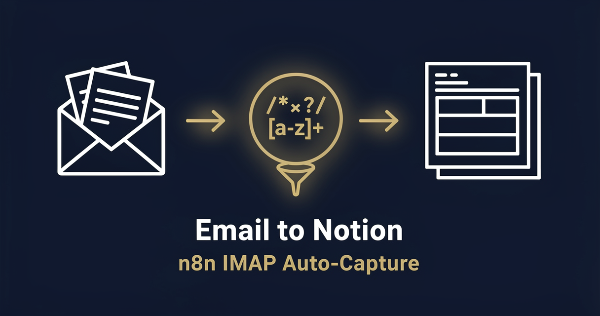

<!-- studiomeyer-mcp-stack-banner:start -->
> **Part of the [StudioMeyer MCP Stack](https://studiomeyer.io)**, Built in Mallorca · ⭐ if you use it
<!-- studiomeyer-mcp-stack-banner:end -->

# Email to Notion

> IMAP polls a mailbox, parses every new email, optionally filters by sender domain or subject keyword, writes a structured row into a Notion database. Idempotent. Filterable. Slack-alerts when Notion fails.



## What this does

The IMAP trigger checks an inbox at every n8n schedule tick (default every 5 min via the trigger's poll interval). For each new unread message the workflow optionally drops it via a sender-domain or subject-keyword whitelist, deduplicates on the email's `Message-ID`, normalizes the body (HTML strip, snippet cap), and writes one row into a Notion database with Subject, From, Snippet, ReceivedAt, AttachmentCount, MessageId.

The result is a customer-mail or invoice-mail mirror in Notion, queryable by your team without giving them mailbox access. The four production patterns mean a flood of arriving mail does not blow up your Notion API quota and a Notion outage does not lose mail (failed writes get a Slack alert + structured log).

## Architecture

```
[IMAP Email]                         IMAP poll, default every 5 min, marks read after process
    │
    ▼
[Filter Email]                       EMAIL_FROM_WHITELIST + EMAIL_SUBJECT_INCLUDE (opt-in)
    │
    ▼
[Rate Limit (opt-in)]                RATE_LIMIT_ENABLED=1, 60 Notion writes / 5 min
    │
    ▼
[Idempotency Check (opt-in)]         IDEMPOTENCY_ENABLED=1, dedup on Message-ID hash
    │
    ▼
[Normalize Email]                    HTML strip, snippet cap, attachment count
    │
    ▼
[Forward Live Items Only]            drop the skipped passthrough items
    │
    ▼
[Notion Create Page]               onError → Error Fallback → Slack Alert
    │
    ▼
[Done]
```

## Setup

1. **Import this workflow** (workflow.json in this folder).
2. **Add an IMAP credential in n8n.** Settings, Credentials, IMAP. Configure host, port, user, password (or app-password).
3. **Wire the IMAP credential to the `IMAP Email` node** in the imported workflow.
4. **Create a Notion Internal Integration.** Go to https://www.notion.so/my-integrations, create new integration, copy the secret token. Set `NOTION_API_TOKEN` env in n8n.
5. **Create a Notion database** with these columns: `Subject` (Title), `From` (Text), `Snippet` (Text), `ReceivedAt` (Date), `Attachments` (Number), `MessageId` (Text). Copy the database ID from the URL (the 32-char hex after `notion.so/<workspace>/`). Set `NOTION_DATABASE_ID` env.
6. **Share the database with your integration.** Open the database, click Share top-right, add your integration. Without this step every write returns 404.
7. **Optional filter envs.**
   - `EMAIL_FROM_WHITELIST=acme.com,vendor.io,partner.org` (only mails from those domains land in Notion)
   - `EMAIL_SUBJECT_INCLUDE=invoice,receipt,order,statement` (only mails whose subject contains any of these)
   - Both can be combined. Both default to off (everything passes).
8. **Optional `SLACK_OPS_WEBHOOK`** for error alerts.
9. **Production patterns (recommended for production).** Set `RATE_LIMIT_ENABLED=1` and `IDEMPOTENCY_ENABLED=1`.
10. **Test.** Send yourself a test email matching your filter, wait for the next IMAP poll, verify a Notion row was created.

### Example Notion database property names

The Notion API expects exact-match property names. The default names this workflow writes:

| Property name | Type | Source |
|---|---|---|
| Subject | Title | email subject |
| From | Text | email From header (display + address) |
| Snippet | Text | first 1800 chars of plain-text body, HTML stripped |
| ReceivedAt | Date | email Date header parsed to ISO-8601 |
| Attachments | Number | count of attachments |
| MessageId | Text | RFC 2822 Message-ID for traceability |

If your database uses different property names, edit the `jsonBody` expression in the `Notion Create Page` node.

## Extending

**LLM categorization.** Insert an OpenAI / Anthropic node between `Normalize Email` and `Forward Live Items Only` that classifies the email into a tag (`invoice`, `support`, `lead`, etc) and adds the result as a `Category` property in Notion. Useful when a team wants Notion as a triaged inbox.

**Attachment archive.** After `Notion Create Page`, fork into an S3 / Google Drive / Dropbox node that uploads each attachment and writes the file URL back into the Notion row. Useful for accounting workflows where receipts must be archived.

**Auto-create CRM contacts.** If the From address is not yet in your CRM, fork into a Pipedrive / HubSpot node after `Forward Live Items Only` that creates a contact. Pair this with the [01 - Form to CRM Lead Router](../01-form-to-crm-lead-router/) for an inbound-channel-agnostic CRM front-door.

**Per-folder routing.** Run multiple instances of this workflow with different `EMAIL_SUBJECT_INCLUDE` values, each writing to a different Notion database. Fastest way to fan out a single inbox into per-topic Notion tables.

## Cost notes

Per execution (one new email):

| Component | Cost (Stand 2026-05) | Per-execution cost |
|---|---|---|
| **n8n** (self-hosted) | free | $0 |
| **n8n Cloud** | from $20/mo | included |
| **Notion API** | free up to 3 calls / sec / integration | $0 |
| **IMAP server** (e.g. Gmail, Fastmail, ProtonMail Bridge) | free with mailbox plan | $0 |

Per-execution cost: **$0**. Pure read + transform + Notion API call. The Notion API is free for the rate buckets this workflow stays inside.

**Worked example at 200 emails / day:** $0 in template-direct costs. Notion API rate limit (3 req/sec) is far above the natural arrival rate from a single mailbox.

## Common gotchas

- **Notion API 404 on the first run.** Almost always means the database is not shared with your integration. Open the database, click Share, add the integration. Re-run.
- **Notion API 400 with `body failed validation`.** Check that your database property names match this workflow's expected names exactly (case-sensitive). Common mismatch: `Received At` vs `ReceivedAt`.
- **HTML body emails create huge snippets.** This workflow runs an HTML strip and caps the snippet at 1800 chars (Notion's per-segment soft limit). If you need the full body, add a separate `Body` property and write the unstripped text there.
- **Same email lands in Notion twice across n8n restarts.** The default idempotency check uses `$getWorkflowStaticData('global')` which is per-workflow-instance. Restarting n8n loses the dedup state. For production, swap to Redis (snippet in the node's comments) or accept the small re-write window.
- **IMAP `IDLE` mode versus polling.** This template uses standard polling. Some IMAP servers support `IDLE` for instant push. n8n's IMAP node defaults to polling. If you flip to IDLE, test that the Idempotency check still catches dedup correctly (different in-memory state).
- **Mark-as-read versus leave-unread.** This workflow marks each processed email as read so the next poll does not re-fetch. If you want to keep the mailbox unread, set the IMAP node's `postProcessAction` to `nothing` and rely entirely on the idempotency check.
- **n8n core HTTP request body shape.** The HTTP Request node's body parameter expects a string, not a JSON object. Wrap with `JSON.stringify({...})` in expressions.
- **n8n error syntax.** Inline error pin uses `{{ $json.error.message }}`. Separate Error Trigger Workflow uses `{{ $json.execution.error.message }}` + `{{ $json.workflow.name }}`. Often-quoted `{{ $error.message }}` does not exist.

## Production patterns

Three opt-in patterns ship in `workflow.json` as actual nodes plus one always-on error branch. The opt-in nodes pass through when their env var is unset, so the default import boots clean.

**Idempotency** (opt-in, `IDEMPOTENCY_ENABLED=1`). The `Idempotency Check` Code node holds a 5-minute in-memory window of seen `sha256(message_id)` hashes via `$getWorkflowStaticData('global')`. The same email, fetched twice from IMAP within the window, lands in Notion once. For clustered n8n deployments, swap the in-memory block for Redis `SET NX EX 300`. The node has the swap pattern in its comments.

**Rate limiting** (opt-in, `RATE_LIMIT_ENABLED=1`). The `Rate Limit` Code node caps Notion writes at 60 in a 5-minute sliding window, scoped workflow-wide. Map bounded at 5000 entries with eviction. For real production loads on a flood-prone mailbox, put rate limiting at the queue level (n8n Queue mode + concurrency cap) and keep this node as defense-in-depth.

**Filter** (opt-in, `EMAIL_FROM_WHITELIST` and / or `EMAIL_SUBJECT_INCLUDE`). The `Filter Email` Code node short-circuits messages that do not match either whitelist. Both lists default to empty (everything passes). The whitelist is comma-separated, lowercase-compared.

**Error branch** (always on). The `Notion Create Page` HTTP Request has `On Error: Continue (Using Error Output)` enabled. The error pin lands at `Error Fallback` which builds a structured error log + the email metadata, then `Slack Alert` posts to `SLACK_OPS_WEBHOOK` if set. The error syntax is `{{ $json.error.message }}`, not `{{ $error.message }}` (does not exist).

There is no HMAC node in this template. The trigger is IMAP poll, server-to-server, not a public webhook.

## Hard compatibility floor

**Minimum n8n version with CVE-2026-27493 fix:** >= 2.9.3 (stable channel) / >= 2.10.1 (latest / beta channel) / >= 1.123.22 (1.x LTS). CVE-2026-27493 is an unauthenticated RCE in Form nodes (CVSS 9.5). This template does not use Form nodes (uses an IMAP trigger), but you should still upgrade for general security.

**Self-hosted Node builtins:** the `Idempotency Check` Code node uses `require('crypto')`. Set `NODE_FUNCTION_ALLOW_BUILTIN=crypto` in your n8n env. n8n Cloud has this allowed by default for hosted plans, verify in your tenant.

**IMAP-supporting mailbox.** Gmail (with App Password and IMAP enabled), Fastmail (built-in IMAP), ProtonMail (via the Bridge), Outlook (with App Password), self-hosted IMAP. OAuth-only inboxes that block password access (some Microsoft 365 tenants by policy) require a different trigger node (Microsoft Outlook node with OAuth).

## Tech stack matrix

| Component | Version | Cost | Free tier | Required when |
|---|---|---|---|---|
| n8n | >= 2.10.1 (CVE-2026-27493 floor) | self-hosted free / Cloud $20/mo | n8n Cloud trial | always |
| Notion | API v2 (`Notion-Version: 2025-09-03`, SDK-default conservative) | free | always | always |
| IMAP mailbox | RFC 3501 compliant | varies | free with most providers | always |

## Credentials checklist

Before activation, create these credentials in n8n:

- [ ] **IMAP** credential (host, port, user, password / app-password). Wired to the `IMAP Email` node.
- [ ] **Notion API token** in `NOTION_API_TOKEN` env. Internal Integration secret from notion.so/my-integrations.
- [ ] **Notion database ID** in `NOTION_DATABASE_ID` env. 32-char UUID from the database URL.
- [ ] **Database shared** with the Notion integration (top-right Share menu in the database page).
- [ ] **Slack incoming webhook URL** in `SLACK_OPS_WEBHOOK` env (optional, for error alerts).

## Need cross-session memory?

This template is stateless on purpose. If you want a customer-history view (the bot recognizes returning senders, builds a per-domain interaction history, surfaces recent conversations on each new email), see the sister [studiomeyer-io/n8n-templates](https://github.com/studiomeyer-io/n8n-templates) repo.

## Related templates

- [01 - Form to CRM Lead Router](../01-form-to-crm-lead-router/) · same Lead-routing pattern with a different trigger
- [13 - Webhook Audit Trail](../13-webhook-audit-trail/) · ingest pattern when the source can sign requests
- [15 - YouTube Channel to Notion](../15-youtube-channel-to-notion/) · Schedule-trigger Notion-write sibling

---

*Built by [StudioMeyer](https://studiomeyer.io) in Mallorca. Issues + ideas at [github.com/studiomeyer-io/n8n-workflows/issues](https://github.com/studiomeyer-io/n8n-workflows/issues).*
