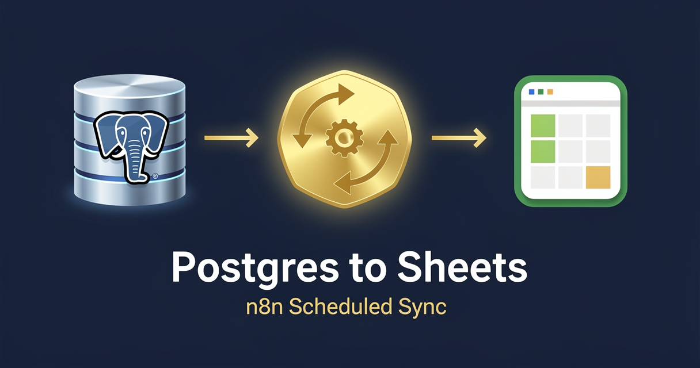

<!-- studiomeyer-mcp-stack-banner:start -->
> **Part of the [StudioMeyer MCP Stack](https://studiomeyer.io)**, Built in Mallorca · ⭐ if you use it
<!-- studiomeyer-mcp-stack-banner:end -->

# Postgres to Google Sheets Sync

> Schedule trigger reads a configurable Postgres SELECT query (with a high-water-mark filter), transforms each row, appends to a Google Sheets spreadsheet, then advances the high-water-mark. Incremental, idempotent, retries-safe, capped against runaway queries.



## What this does

A scheduled run (default daily 06:00 UTC) reads the high-water-mark from workflow state, fires your `PG_SYNC_QUERY` against Postgres with the timestamp as `$1`, dedupes rows by primary key, caps at `MAX_ROWS_PER_RUN` (default 5000), projects each row into a Sheets row-shape, appends to your spreadsheet via the Sheets API, then advances the high-water-mark only if the append succeeded.

The result is a Postgres-to-Sheets mirror that is incremental (only new or updated rows since the last run), idempotent (the same primary key cannot land in Sheets twice within 24 hours), and capped (a runaway query that returns 100k rows still only writes 5k per run, picks up the rest on the next tick).

## Architecture

```
[Schedule (Daily 06:00 UTC)]
    │
    ▼
[Read HWM]                           $getWorkflowStaticData('global').lastSyncedAt
    │
    ▼
[Postgres Query]                     PG_SYNC_QUERY env, $1 = HWM, onError → Error Fallback
    │
    ▼
[Rate Limit (opt-in)]                RATE_LIMIT_ENABLED=1, 60 Sheets calls / 5 min
    │
    ▼
[Idempotency Check (opt-in)]         IDEMPOTENCY_ENABLED=1, 24h window on row PK
    │
    ▼
[Cap MAX_ROWS_PER_RUN]               defense for runaway queries, default 5000
    │
    ▼
[Transform Rows]                     project to PG_SYNC_COLUMN_ORDER, JSON-stringify objects
    │
    ▼
[Append to Sheets]                   onError → Error Fallback → Slack Alert
    │
    ▼
[Update HWM]                         max(updated_at) of synced rows, persisted
```

## Setup

1. **Import this workflow** (workflow.json in this folder).
2. **Add a Postgres credential.** Settings, Credentials, Postgres. Read-only replica recommended. Wire it into the `Postgres Query` node.
3. **Set `PG_SYNC_QUERY`** to a SELECT statement using `$1` as the high-water-mark placeholder. The `ORDER BY` should match the high-water-mark field. Always include a `LIMIT` matching `MAX_ROWS_PER_RUN`.

   ```sql
   SELECT id, email, full_name, created_at, updated_at
   FROM users
   WHERE updated_at > $1
   ORDER BY updated_at ASC
   LIMIT 5000
   ```
4. **Set `PG_SYNC_HWM_INITIAL`** to a seed ISO-8601 timestamp for the very first run. Example: `2026-01-01T00:00:00Z`. After the first run the workflow state takes over.
5. **Set `PG_SYNC_HWM_FIELD`** to the timestamp column name used in `ORDER BY` (default `updated_at`). The workflow advances the high-water-mark to `max(this field)` on the synced batch.
6. **Set `PG_SYNC_DEDUP_KEY`** to the row primary key column (default `id`).
7. **Set `PG_SYNC_COLUMN_ORDER`** to a comma-separated list naming the column order in Sheets. Example: `id,email,full_name,created_at,updated_at`. Without this, the workflow falls back to the keys of the first row, ordering not guaranteed.
8. **Add a Google Sheets OAuth2 credential.** Settings, Credentials, Google Sheets OAuth2. Wire it into the `Append to Sheets` node.
9. **Set `GOOGLE_SHEETS_ID`** to the target spreadsheet ID (the long string in the URL between `/d/` and `/edit`).
10. **Set `GOOGLE_SHEETS_RANGE`** to the tab + column range. Example: `Sheet1!A1:Z`. The append API places new rows below the last non-empty row in the range.
11. **Production patterns (recommended).** Set `RATE_LIMIT_ENABLED=1` and `IDEMPOTENCY_ENABLED=1`.
12. **Optional `SLACK_OPS_WEBHOOK`** for error alerts.
13. **Test.** Manually run the workflow. Inspect Sheets. The next scheduled run will pick up only rows updated since the first run.

## Extending

**Multi-tenant fan-out.** Replace the single `PG_SYNC_QUERY` env with a per-tenant lookup. Read tenants from a Postgres meta-table at the start of each run, loop over them, build the SELECT for each, write to per-tenant sheets. Useful for SaaS products that need to give each customer a per-account export.

**JSON normalization for nested fields.** If your Postgres query returns JSONB columns, the default Transform node `JSON.stringify`s them into a single Sheets cell. To flatten into multiple columns, edit the `Transform Rows` Code node to expand specific JSONB keys into top-level fields.

**Soft-delete handling.** If your source table uses a `deleted_at IS NOT NULL` soft-delete pattern, exclude those rows in the WHERE clause OR include them and add a `deleted_at` column in Sheets so reviewers see deletions explicitly.

**Sheets formula columns.** Sheets accepts Excel-style formulas (`=A2+B2`) when `valueInputOption=USER_ENTERED`. Add a static formula in row 2 of your sheet and Sheets will auto-fill the formula for new rows. Useful for derived columns the source Postgres does not have.

**Multi-table fan-out.** Run multiple instances of this workflow with different `PG_SYNC_QUERY` and `GOOGLE_SHEETS_RANGE` (different tabs of the same spreadsheet). Fastest way to mirror many tables into one operations workbook.

## Cost notes

Per execution (one scheduled run):

| Component | Cost (Stand 2026-05) | Per-execution cost |
|---|---|---|
| **n8n** (self-hosted) | free | $0 |
| **n8n Cloud** | from $20/mo | included |
| **Postgres** (own infrastructure or managed RDS / Supabase / Neon) | varies | $0 marginal |
| **Google Sheets API** | free up to 300 read + 60 write per minute per project | $0 |

Per-execution cost: **$0**. Read from Postgres (your own infra), write to Sheets (free quota covers nearly any solo or SMB load).

**Worked example at 5000 rows / day:** $0 in template-direct costs. Sheets API write quota (60 calls / min / project) is far above what one scheduled run uses (one batch append per run).

## Common gotchas

- **`PG_SYNC_HWM_INITIAL` not set on first run.** The workflow throws a clear error. Set it to a seed timestamp far enough in the past to capture the rows you want on the first run, then let the state advance.
- **Sheets API 403 with `The caller does not have permission`.** The OAuth2 credential's email is not added to the spreadsheet's Share list. Open the sheet, Share, add the OAuth credential's email (look in the credential's preview).
- **Rows skipped because `updated_at` did not change.** This is by design when your source table updates other columns without touching `updated_at`. Ensure your source app touches `updated_at = now()` on every UPDATE, OR pick a different HWM field that strictly monotonically advances (e.g. an autoincrement `id` plus an `id > $1` predicate).
- **Postgres timestamp precision smaller than millisecond.** PostgreSQL `timestamptz` has microsecond precision. JavaScript `new Date().toISOString()` rounds to milliseconds. Two rows with the same millisecond can lose one on the next run if you use `>` instead of `>=`. Mitigation: use `>=` plus the idempotency check on the primary key (already in this workflow).
- **`MAX_ROWS_PER_RUN` cap is silent.** If your query returns more rows than the cap, the workflow takes the first slice (sorted by HWM ASC) and discards the rest. The next run picks them up because the HWM only advances on synced rows. Verify in the run output that `rowCount` matches what you expected.
- **`PG_SYNC_COLUMN_ORDER` and Sheets column drift.** If you add a column to Sheets without adding it to `PG_SYNC_COLUMN_ORDER`, the Sheets append will leave that column blank for new rows. If you add a column to the env without a matching column in Sheets, the value just goes into the next free column.
- **n8n core HTTP request body shape.** The HTTP Request node's body parameter expects a string, not a JSON object. Wrap with `JSON.stringify({...})` in expressions.
- **n8n error syntax.** Inline error pin uses `{{ $json.error.message }}`. Separate Error Trigger Workflow uses `{{ $json.execution.error.message }}` + `{{ $json.workflow.name }}`. Often-quoted `{{ $error.message }}` does not exist.

## Production patterns

Three opt-in patterns ship in `workflow.json` as actual nodes plus one always-on error branch. The opt-in nodes pass through when their env var is unset, so the default import boots clean.

**Idempotency** (opt-in, `IDEMPOTENCY_ENABLED=1`). The `Idempotency Check` Code node holds a 24-hour in-memory window of seen `sha256(row.id)` hashes via `$getWorkflowStaticData('global')`. The same primary key, fetched twice across consecutive runs, lands in Sheets once. The 24-hour window matches the natural daily cadence. For clustered n8n deployments, swap the in-memory block for Redis `SET NX EX 86400`. The node has the swap pattern in its comments.

**Rate limiting** (opt-in, `RATE_LIMIT_ENABLED=1`). The `Rate Limit` Code node caps Sheets API calls at 60 in a 5-minute sliding window. The actual Sheets API limit is 60 writes / min / project (different units), the local cap is intentionally lower as defense-in-depth. For real production loads on shared n8n instances, also configure a per-project quota in Google Cloud Console.

**Hard cap on rows per run** (`MAX_ROWS_PER_RUN`, default 5000). The `Cap MAX_ROWS_PER_RUN` Code node slices the result set if a runaway query returns too many rows. The HWM advances only on the synced rows, so the rest get picked up on the next scheduled tick. Without this cap, a missing `LIMIT` in the SELECT could blow up the n8n worker memory or hit the Sheets API per-request size cap.

**Error branch** (always on). The `Postgres Query` and `Append to Sheets` nodes both have `On Error: Continue (Using Error Output)` enabled. The error pin lands at `Error Fallback` which builds a structured error log identifying which stage failed (post-postgres or post-sheets). `Slack Alert` posts to `SLACK_OPS_WEBHOOK` if set. Critically, the HWM update only fires on the success path, so a failed run does not advance the marker.

There is no HMAC node in this template. The trigger is Schedule, server-internal, not a public webhook.

## Hard compatibility floor

**Minimum n8n version with CVE-2026-27493 fix:** >= 2.9.3 (stable channel) / >= 2.10.1 (latest / beta channel) / >= 1.123.22 (1.x LTS). CVE-2026-27493 is an unauthenticated RCE in Form nodes (CVSS 9.5). This template does not use Form nodes (uses Schedule + Postgres + Sheets), but you should still upgrade for general security.

**Self-hosted Node builtins:** the `Idempotency Check` Code node uses `require('crypto')`. Set `NODE_FUNCTION_ALLOW_BUILTIN=crypto` in your n8n env. n8n Cloud has this allowed by default for hosted plans, verify in your tenant.

**Postgres version:** any version that supports parameterized SELECT with timestamp comparison. PostgreSQL 12+ recommended. The workflow does not use any version-specific features.

## Tech stack matrix

| Component | Version | Cost | Free tier | Required when |
|---|---|---|---|---|
| n8n | >= 2.10.1 (CVE-2026-27493 floor) | self-hosted free / Cloud $20/mo | n8n Cloud trial | always |
| Postgres | 12+ | free (self) / varies (managed) | yes (most managed providers) | always |
| Google Sheets API v4 | latest | free | 300 read + 60 write / min / project | always |

## Credentials checklist

Before activation, create these credentials in n8n:

- [ ] **Postgres** credential (host, port, user, password, database). Wired to the `Postgres Query` node.
- [ ] **Google Sheets OAuth2** credential. Wired to the `Append to Sheets` node.
- [ ] **Spreadsheet shared** with the OAuth credential's email (look in the credential's preview).
- [ ] **All env vars set:** `PG_SYNC_QUERY`, `PG_SYNC_HWM_INITIAL`, `PG_SYNC_HWM_FIELD` (default `updated_at`), `PG_SYNC_DEDUP_KEY` (default `id`), `PG_SYNC_COLUMN_ORDER`, `GOOGLE_SHEETS_ID`, `GOOGLE_SHEETS_RANGE`.
- [ ] **Slack incoming webhook URL** in `SLACK_OPS_WEBHOOK` env (optional, for error alerts).

## Need cross-session memory?

This template is a pure ETL pipeline. No reasoning, no LLM, no per-record context. If your downstream operations need richer state (per-customer health score, multi-source aggregation, semantic search across rows), see the sister [studiomeyer-io/n8n-templates](https://github.com/studiomeyer-io/n8n-templates) repo.

## Related templates

- [03 - Uptime Monitor with Alerts](../03-uptime-monitor-with-alerts/) · same Schedule-trigger pattern with HTTP-check business logic
- [09 - Calendar Conflict Detector](../09-calendar-conflict-detector/) · same Schedule-trigger pattern with multi-source fan-out
- [11 - Email to Notion](../11-email-to-notion/) · ingest-side sibling for inbound mail to Notion

---

*Built by [StudioMeyer](https://studiomeyer.io) in Mallorca. Issues + ideas at [github.com/studiomeyer-io/n8n-workflows/issues](https://github.com/studiomeyer-io/n8n-workflows/issues).*
