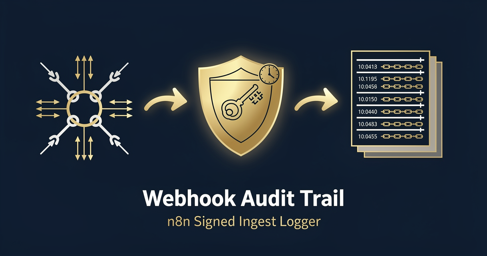

<!-- studiomeyer-mcp-stack-banner:start -->
> **Part of the [StudioMeyer MCP Stack](https://studiomeyer.io)**, Built in Mallorca · ⭐ if you use it
<!-- studiomeyer-mcp-stack-banner:end -->

# Webhook Audit Trail

> Generic ingest endpoint for signed audit events. Verifies HMAC + replay-window, rate-limits per IP, dedupes by request-id, persists to a Postgres `audit_log` with a hash chain across rows so tampering becomes detectable. Slack-alerts on signature-fail (security event) and rate-limit-hit (DoS event).



## What this does

Any system that can sign HTTP requests POSTs an event to the webhook URL. The workflow verifies the HMAC signature against `AUDIT_SIGNING_SECRET`, checks the timestamp against a 5-minute replay window, rate-limits per source IP, dedupes on `x-request-id` (or hashed body when no request-id is supplied), then runs a single atomic SQL `INSERT` that locks the previous row's `row_hash` via `SELECT ... FOR UPDATE`, computes the new `row_hash` inside the database via `pgcrypto.digest()`, and writes the new row. The response is 200 with `{id, prevHash, rowHash}` so the caller can verify the chain.

The hash chain means that if anyone deletes or mutates a row in the database, the chain breaks at that row and every row after it. The integrity of the entire audit log can be re-verified by replaying the chain from row 1. Because the `prev_hash` is read inside the same transaction as the new `INSERT` and locked via `FOR UPDATE`, two concurrent inserts cannot both bind themselves to the same predecessor. The chain stays intact across n8n restarts (state is in the database, not in workflow static data) and across concurrent webhook requests.

## Architecture

```
[Audit Webhook]                    rawBody for HMAC, payload <= MAX_BODY_BYTES
    │
    ▼
[Verify Webhook (opt-in)]          AUDIT_SIGNING_SECRET + timestamp replay-window
    │  (error pin) ─────────────► [Error Fallback] ─► [Slack Alert] ─► [Error Respond 401]
    ▼
[Rate Limit (opt-in)]              per-IP sliding window, capacity event on breach
    │  (error pin) ─────────────► [Error Fallback] ─► [Slack Alert] ─► [Error Respond 429]
    ▼
[Idempotency Check (opt-in)]       x-request-id or hash(body), 5-min window
    │  (error pin) ─────────────► [Error Fallback] ─► [Slack Alert] ─► [Error Respond 500]
    ▼
[Build Audit Row]                  payload + payload_hash + metadata only (chain in SQL)
    │
    ▼
[Forward Live Items Only]          drop dedup duplicates so they never reach the DB
    │
    ▼
[Postgres Insert]                  WITH last AS (SELECT row_hash FROM audit_log ORDER BY id DESC
    │                              LIMIT 1 FOR UPDATE) INSERT ... digest() RETURNING id, prev_hash, row_hash
    │  (error pin) ─────────────► [Error Fallback] ─► [Slack Alert] ─► [Error Respond 500]
    ▼
[Respond 200 with {id, prevHash, rowHash}]
```

## Setup

1. **Import this workflow** (workflow.json in this folder).
2. **Add a Postgres credential** for the audit-log database. Wire it into the `Postgres Insert` node.
3. **Create the `audit_log` table + enable `pgcrypto`.** Run this DDL once (idempotent):

   ```sql
   -- Required for digest() in the atomic-hash-chain INSERT.
   CREATE EXTENSION IF NOT EXISTS pgcrypto;

   CREATE TABLE IF NOT EXISTS audit_log (
     id BIGSERIAL PRIMARY KEY,
     received_at TIMESTAMPTZ NOT NULL,
     event_type TEXT NOT NULL,
     event_source TEXT NOT NULL,
     source_ip TEXT,
     source_user_agent TEXT,
     signed BOOLEAN NOT NULL,
     payload TEXT NOT NULL,
     payload_hash TEXT NOT NULL,
     prev_hash TEXT NOT NULL,
     row_hash TEXT NOT NULL,
     dedup_key TEXT
   );

   CREATE INDEX IF NOT EXISTS idx_audit_log_received_at ON audit_log(received_at DESC);
   CREATE INDEX IF NOT EXISTS idx_audit_log_event_type ON audit_log(event_type);
   CREATE INDEX IF NOT EXISTS idx_audit_log_event_source ON audit_log(event_source);
   CREATE INDEX IF NOT EXISTS idx_audit_log_payload_hash ON audit_log(payload_hash);
   ```

4. **Set `AUDIT_SIGNING_SECRET`** to a 32+ char random string. Configure your client to sign requests with `x-audit-signature: <hex hmac-sha256(timestamp + '.' + rawBody)>` and `x-audit-timestamp: <unix-seconds>`.
5. **Set `WEBHOOK_INTEGRITY_CHECK_ENABLED=1`** for production.
6. **Set `RATE_LIMIT_ENABLED=1`** and `IDEMPOTENCY_ENABLED=1`.
7. **Set `SLACK_SECURITY_WEBHOOK`** for security + capacity alerts.
8. **Test with a signed request:**

   ```bash
   TS=$(date +%s)
   BODY='{"event":"user.login","user_id":42,"at":"'$(date -u +%Y-%m-%dT%H:%M:%SZ)'"}'
   SIG=$(printf "%s" "${TS}.${BODY}" | openssl dgst -sha256 -hmac "$AUDIT_SIGNING_SECRET" -hex | awk '{print $2}')
   curl -X POST https://your-n8n.example.com/webhook/audit-ingest \
     -H "Content-Type: application/json" \
     -H "x-audit-timestamp: $TS" \
     -H "x-audit-signature: $SIG" \
     -H "x-audit-event-type: user.login" \
     -H "x-audit-source: app-prod" \
     -H "x-request-id: $(uuidgen)" \
     --data "$BODY"
   ```

   Expected response: `{"ok": true, "id": 1, "rowHash": "<64-char-hex>"}`.
9. **Verify the chain.** Run this SQL to confirm `row_hash` of row N equals what you would re-compute from row N-1's `row_hash` plus row N's payload:

   ```sql
   SELECT id, prev_hash, row_hash,
          encode(digest('{"prevHash":"'||prev_hash||'","payloadHash":"'||payload_hash||'","signed":'||signed||',"sourceIp":"'||COALESCE(source_ip,'')||'","sourceUserAgent":'||COALESCE('"'||source_user_agent||'"','null')||',"eventType":"'||event_type||'","eventSource":"'||event_source||'","receivedAt":"'||to_char(received_at AT TIME ZONE 'UTC','YYYY-MM-DD"T"HH24:MI:SS.MSZ')||'"}', 'sha256'), 'hex') AS recomputed_hash
   FROM audit_log
   ORDER BY id;
   ```

   Note: the SQL recompute is sensitive to JSON serialization order, so for production verify in your application code, not in raw SQL.

## Extending

**Per-source partitioning.** Add a `tenant_id` column populated from a header like `x-audit-tenant`. Index on `(tenant_id, received_at)`. Useful when the audit log serves multiple customer tenants on shared infrastructure.

**GDPR retention sweep.** Add a separate scheduled workflow (daily 03:00 UTC) that runs `DELETE FROM audit_log WHERE received_at < now() - interval '90 days'`. The hash chain breaks for the deleted rows, but the chain after the deletion stays self-consistent. Document the retention window in your privacy policy. For DSGVO Art. 17 erasure on a specific user, also support `DELETE WHERE event_source = $1 AND payload::jsonb @> '{"user_id": $2}'`.

**S3 / Glacier archive.** Add a daily export workflow that writes yesterday's `audit_log` rows as JSON Lines to S3, with the `row_hash` as the object key. Cold archive that the regulator can verify, while keeping hot Postgres lean.

**SIEM forward.** After `Postgres Insert`, fork into an HTTP node that POSTs to your SIEM (Splunk HEC, Datadog Logs, Elastic). Use the `signed=true` and `category=auth` events as security signals.

**Hash-chain verifier.** Write a small standalone tool that reads `audit_log` in order, recomputes each `row_hash` from the previous, and reports the first row where the chain breaks. Run it as a scheduled job and alert on breaks.

## Cost notes

Per execution (one signed event):

| Component | Cost (Stand 2026-05) | Per-execution cost |
|---|---|---|
| **n8n** (self-hosted) | free | $0 |
| **n8n Cloud** | from $20/mo | included |
| **Postgres** (own infrastructure or managed RDS / Supabase / Neon) | varies | $0 marginal |
| **Slack incoming webhook** (security alerts only) | free | $0 |

Per-execution cost: **$0**. Pure CPU + DB INSERT, no external API beyond Slack on errors.

**Worked example at 1 million events / month** (33k / day, ~23 / min average): $0 in template-direct costs. Postgres write-rate is well below what a small RDS instance handles (~5k writes / second). The hash chain adds about 64 bytes / row + the SHA-256 compute (negligible).

## Common gotchas

- **First row's `prev_hash` is `0` repeated 64 times.** This is the genesis-block convention. Verifiers should special-case row 1. The atomic SQL uses `COALESCE((SELECT prev_hash FROM last), repeat('0', 64))` so the genesis fallback is in the database, not in n8n state.
- **Workflow restart no longer loses chain state.** The previous design read `prev_hash` from `$getWorkflowStaticData('global').lastRowHash` which was per-instance and reset on restart. The current design reads `prev_hash` from `audit_log` itself inside the INSERT transaction via `SELECT ... FOR UPDATE LIMIT 1`. Restarts are seamless. The chain extends from whatever the last row in the DB is.
- **Concurrent inserts no longer fork the chain.** Two simultaneous webhook requests both reach `Postgres Insert`, both run the CTE, both attempt `SELECT ... FOR UPDATE` on the latest row. Postgres serializes them: the second waits for the first to commit, then sees the new row, locks it, and binds itself to it. The chain stays linear without needing `maxConcurrency: 1` at the workflow level (which is not a built-in n8n setting anyway).
- **Retries from the source can replay even with HMAC + replay-window.** If the source retries within the 5-minute window with the same body and a fresh timestamp, the dedup check on `x-request-id` catches it. Always set `x-request-id` to a UUID generated by the source.
- **HMAC failure should NOT be retried.** Some clients retry on 401, which is wrong. Document in your client integration that 401 from this endpoint means signature mismatch and is final.
- **Rate-limit responses must be respected (back-off).** Document for clients: 429 means slow down. Clients that retry too fast on 429 trigger another rate-limit hit and will be temp-blocked at the reverse proxy.
- **`MAX_BODY_BYTES` cap is intentional.** A 1GB POST against this endpoint would blow up the n8n worker memory. Default 1MB is generous for typical event sizes. Override via env if you have a legitimate reason.
- **n8n core HTTP request body shape.** The HTTP Request node's body parameter expects a string, not a JSON object. Wrap with `JSON.stringify({...})` in expressions.
- **n8n error syntax.** Inline error pin uses `{{ $json.error.message }}`. Separate Error Trigger Workflow uses `{{ $json.execution.error.message }}` + `{{ $json.workflow.name }}`. Often-quoted `{{ $error.message }}` does not exist.

## Production patterns

Four patterns wired. HMAC verify is the heart of the template, this is an ingest endpoint that adversaries may try to forge.

**HMAC + replay-window** (opt-in, `WEBHOOK_INTEGRITY_CHECK_ENABLED=1` + `AUDIT_SIGNING_SECRET`). The signed payload is `<timestamp>.<rawBody>` (Stripe-style), the timestamp comes in via `x-audit-timestamp` (unix seconds), and the signature comes in via `x-audit-signature` (hex HMAC-SHA256). The verifier first checks the timestamp against a 5-minute replay window (override via `AUDIT_REPLAY_WINDOW_S`), then `crypto.timingSafeEqual` compares the recomputed HMAC. Length-guard before the timing-safe compare prevents `RangeError` DoS from a 1-char signature.

**Rate limiting** (opt-in, `RATE_LIMIT_ENABLED=1`). Per-IP sliding window, default 60 req / 5 min / IP (override via `AUDIT_RATE_LIMIT_PER_IP`). Map bounded at 5000 entries with eviction. Rate-limit hits route to the error branch and trigger a Slack capacity alert because they signal either an abusive client or a flood event worth knowing about.

**Idempotency** (opt-in, `IDEMPOTENCY_ENABLED=1`). 5-minute in-memory window. Dedup key preference: `x-request-id` header > `sha256(rawBody)`. The same `x-request-id` lands in the audit log once. Critically, dedup hits are dropped before `Postgres Insert` so they do not consume a chain link, which keeps `prev_hash` -> `row_hash` continuity intact across retries.

**Atomic hash chain in SQL** (always on). The `Postgres Insert` is a single atomic statement: `WITH last AS (SELECT row_hash FROM audit_log ORDER BY id DESC LIMIT 1 FOR UPDATE), seed AS (SELECT COALESCE((SELECT row_hash FROM last), repeat('0',64)) AS prev_hash, ...) INSERT INTO audit_log (...) SELECT ..., encode(digest(json_build_object(...)::text, 'sha256'), 'hex') AS row_hash FROM seed RETURNING id, prev_hash, row_hash;`. The `FOR UPDATE` lock + same-transaction `SELECT` + `INSERT` makes the chain race-safe across concurrent webhook requests. The `digest()` call comes from the `pgcrypto` extension. Field order in `json_build_object` is fixed so the hash is deterministic and re-verifiable from the data alone. Tampering with row N changes row N's `row_hash` and breaks the chain at row N+1.

**Error branch** (always on). Verify, Rate Limit, Idempotency Check, and Postgres Insert all have `On Error: Continue (Using Error Output)` and route their error pins to the `Error Fallback` Code node. The fallback classifies the error (auth, capacity, database), picks an HTTP status (401 / 413 / 429 / 500), and produces a structured response. Slack alert categories: critical (auth, database) vs warning (capacity).

## Hard compatibility floor

**Minimum n8n version with CVE-2026-27493 fix:** >= 2.9.3 (stable channel) / >= 2.10.1 (latest / beta channel) / >= 1.123.22 (1.x LTS). CVE-2026-27493 is an unauthenticated RCE in Form nodes (CVSS 9.5). This template does not use Form nodes (uses a Webhook), but you should still upgrade for general security.

**Self-hosted Node builtins:** the `Verify Webhook`, `Idempotency Check`, and `Build Audit Row` Code nodes use `require('crypto')`. Set `NODE_FUNCTION_ALLOW_BUILTIN=crypto` in your n8n env. n8n Cloud has this allowed by default for hosted plans, verify in your tenant.

**Postgres version:** any version that supports `BIGSERIAL`, `TIMESTAMPTZ`, `digest()` (via pgcrypto for the optional verifier query). PostgreSQL 12+ recommended.

## Tech stack matrix

| Component | Version | Cost | Free tier | Required when |
|---|---|---|---|---|
| n8n | >= 2.10.1 (CVE-2026-27493 floor) | self-hosted free / Cloud $20/mo | n8n Cloud trial | always |
| Postgres | 12+ | free (self) / varies (managed) | yes (most managed providers) | always |
| Slack incoming webhook | URL only, no auth | free | always | optional (security alerts) |

## Credentials checklist

Before activation, create these credentials in n8n:

- [ ] **Postgres** credential (host, port, user, password, audit-log database). Wired to the `Postgres Insert` node.
- [ ] **`audit_log` table** created (DDL above).
- [ ] **`AUDIT_SIGNING_SECRET`** env set to a 32+ char random string. Same value distributed to your signing client (out-of-band).
- [ ] **`WEBHOOK_INTEGRITY_CHECK_ENABLED=1`** for production.
- [ ] **`SLACK_SECURITY_WEBHOOK`** in env (recommended).

## Need cross-session memory?

This template is an audit-trail surface, not a memory layer. If your downstream analyzer needs context like a per-actor rolling history or anomaly-detection scoring across sessions, see the sister [studiomeyer-io/n8n-templates](https://github.com/studiomeyer-io/n8n-templates) repo.

## Related templates

- [02 - Stripe Lifecycle to Slack](../02-stripe-lifecycle-to-slack/) · same HMAC + Slack-alert pattern with provider-specific signing
- [10 - CSV Bulk Validator](../10-csv-bulk-validator/) · same HMAC + replay-window pattern with body-parsing-and-validate
- [12 - Postgres to Sheets Sync](../12-postgres-to-sheets-sync/) · same Postgres-write pattern with Schedule trigger

---

*Built by [StudioMeyer](https://studiomeyer.io) in Mallorca. Issues + ideas at [github.com/studiomeyer-io/n8n-workflows/issues](https://github.com/studiomeyer-io/n8n-workflows/issues).*
