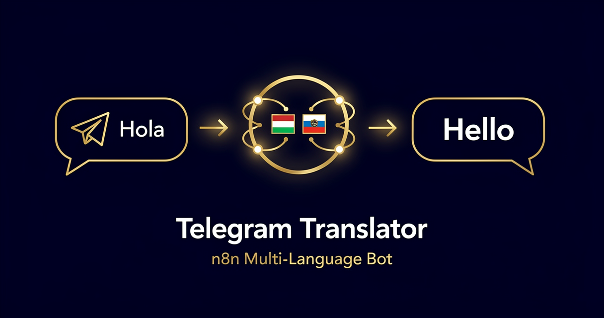

<!-- studiomeyer-mcp-stack-banner:start -->
> **Part of the [StudioMeyer MCP Stack](https://studiomeyer.io)**, Built in Mallorca · ⭐ if you use it
<!-- studiomeyer-mcp-stack-banner:end -->

# Telegram Translator Bot

> Telegram bot that detects the source language of any incoming message and replies with a translation in the configured target language. Multi-provider LLM (OpenAI default, Anthropic optional). Per-user rate limit, idempotency on update_id, LLM fallback that does not leak the system prompt.



## What this does

A user sends any text message to your bot in Telegram. The Telegram Trigger fires (with the `X-Telegram-Bot-Api-Secret-Token` validated by the node itself when `TELEGRAM_WEBHOOK_SECRET` is set). The workflow filters non-text updates, rate-limits per user_id, dedupes on Telegram's `update_id`, builds a translation system prompt, routes to the configured LLM provider (OpenAI default or Anthropic), normalizes the response into a stable shape, and replies in the same chat with the translated text.

If the LLM call fails (rate-limit, timeout, key error), the workflow sends a graceful TTS-friendly fallback ("Sorry, the translator is having trouble") instead of a system-prompt leak. The discriminator on `isLlmError` versus router-fallback (typo in `LLM_PROVIDER`) prevents accidental private-context disclosure in the audit trail.

## Architecture

```
[Telegram Trigger]                   secret_token verified by node when configured
    │
    ▼
[Filter Text Messages]               skip stickers, photos, voice, bot commands, bot self-msgs
    │
    ▼
[Rate Limit (opt-in)]                per user_id sliding window, 60 / 5 min
    │
    ▼
[Idempotency Check (opt-in)]         5-min window on update_id
    │
    ▼
[Set Provider]                       read TARGET_LANG, build system prompt, LLM_PROVIDER
    │
    ▼
[Route by Provider]                  Switch with skipped + openai + anthropic + fallback
    |              |              |              |
    skipped     openai          anthropic       fallback
    (drop)         |              |              |
                   v              v              |
            [OpenAI Translate] [Anthropic Translate]
                   |              |              |
                   |  onError ----+              |
                   v              v              v
            [Normalize LLM Output]      [LLM Fallback Reply]
                   |                            |
                   v                            v
            [Telegram Reply]              [Telegram Fallback Reply]
                   │
                onError → LLM Fallback Reply
```

## Setup

1. **Create the bot.** Talk to @BotFather on Telegram, `/newbot`, follow prompts. Save the bot token.
2. **Add a Telegram credential** in n8n (Settings, Credentials, Telegram Bot). Paste the token. Wire it into both the trigger and the two send-message HTTP nodes.
3. **Import this workflow** (workflow.json in this folder).
4. **Activate the workflow** in n8n. Note the production webhook URL the trigger node displays.
5. **Set the Telegram webhook with a secret_token:**

   ```bash
   SECRET=$(openssl rand -hex 32)
   curl "https://api.telegram.org/bot<TOKEN>/setWebhook?url=https://your-n8n.example.com/webhook/telegram-translator-trigger&secret_token=$SECRET&allowed_updates=%5B%22message%22%5D"
   ```

   Set `TELEGRAM_WEBHOOK_SECRET=<same value>` in n8n env. The trigger node validates each incoming webhook against this. Without the secret, Telegram-spoofed payloads can hit your n8n instance.
6. **Set `TARGET_LANG`** to the language you want translations in. BCP-47 codes (`en`, `de`, `es`, `fr`, `ja`) or English language names (`English`, `Deutsch`) both work, the prompt is tolerant.
7. **Set `LLM_PROVIDER`** to `openai` (default) or `anthropic`.
8. **Add the matching credential** (OpenAI API or Anthropic API).
9. **Production patterns:** set `RATE_LIMIT_ENABLED=1` and `IDEMPOTENCY_ENABLED=1`.
10. **Test.** Open the chat with your bot, send "Hola, como estas?". You should get the English translation back within 2-3 seconds.

## Multi-provider switch

The workflow has a `Set Provider` node followed by a `Route by Provider` Switch. Default value is `openai`. Change `LLM_PROVIDER=anthropic` and the Switch routes to the Anthropic branch instead. Both branches converge in `Normalize LLM Output` which extracts the reply text from either provider's response shape.

The Switch has a `fallbackOutput: extra` route that catches any unrecognized provider value (typo, env-var mismatch). The fallback path goes to `LLM Fallback Reply`, which discriminates between LLM-error and router-error so the system prompt never gets stringified into the error log.

To add a third provider (say Google Gemini), copy the OpenAI HTTP node, change the URL and credentials, add a new rule to the Switch, and connect to `Normalize LLM Output`. Update `Normalize LLM Output` to recognize the new response shape (`candidates[0].content.parts[0].text` for Gemini).

## Extending

**Auto-detect target from sender.** Read the sender's `language_code` from `message.from.language_code` in the Telegram payload. Translate to the sender's own language only if the source differs. Useful for community channels with many languages.

**Group-chat mode.** By default this template replies to every text message. In a group chat that gets noisy. Add a filter that only triggers on messages mentioning the bot username (`@yourbot translate this: ...`).

**Cache common translations.** Add a Postgres lookup before the LLM call: hash the source text + target language, check if it was translated within the last 24 hours, return the cache hit if found. Saves LLM cost on repeated translations.

**Voice notes via Whisper.** Drop the non-text filter, add an OpenAI Whisper node before `Set Provider` that transcribes voice notes to text, then translate. Useful for multilingual customer support.

**Inline-mode bot.** Telegram inline mode lets users type `@yourbot some text` in any chat. Add the `inline_query` update type to `Telegram Trigger`, fork into a separate `answerInlineQuery` HTTP call. Returns the translation as a suggestion the user can tap to send.

## Cost notes

Per execution (one user message):

| Component | Cost (Stand 2026-05) | Per-execution cost |
|---|---|---|
| **n8n** (self-hosted) | free | $0 |
| **n8n Cloud** | from $20/mo | included |
| **OpenAI gpt-5.4-mini** | $0.75 / 1M input + $4.50 / 1M output | ~$0.0008 per typical message |
| **Anthropic claude-haiku-4-5** | $1.00 / 1M input + $5.00 / 1M output | ~$0.001 per typical message |
| **Telegram Bot API** | free | $0 |

Per-execution cost: **~$0.001 with OpenAI default**. Per-message LLM call is small because the typical Telegram text is short (50-200 chars in, 50-200 chars out).

**Worked example at 1000 messages / day with OpenAI:**

| Stack | Cost | Total /mo |
|---|---|---|
| n8n self-hosted + OpenAI | ~$0.001 / msg | ~$30 / mo |
| n8n Cloud + OpenAI | $20 base + ~$30 LLM | ~$50 / mo |

The error branch fires on LLM rate limits and Telegram outages. The fallback Code node does not call the LLM, so error branches do not consume LLM tokens.

## Common gotchas

- **`X-Telegram-Bot-Api-Secret-Token` mismatch silently fails.** Telegram POSTs the webhook with the header set to whatever you configured in `setWebhook?secret_token=`. n8n's Telegram Trigger validates this against the credential's stored secret. If the values do not match, the trigger returns 401 to Telegram and the bot looks dead. Test by re-running `setWebhook` with the same secret_token and update env in n8n.
- **`getWebhookInfo` shows pending updates.** If the bot was offline and updates queued, Telegram delivers them all in a burst when the webhook comes back. The rate-limit + idempotency-check both apply. Adjust `AUDIT_RATE_LIMIT_PER_IP` if you expect burst recovery.
- **Bot token leak via `Telegram Reply` URL.** The HTTP node templates `https://api.telegram.org/bot{{ $credentials.telegramApi.accessToken }}/sendMessage`. n8n masks the token in the UI but it is logged at debug level. Avoid `N8N_LOG_LEVEL=debug` in production. Better: use the n8n Telegram node directly (it handles auth without expression-templating). The workflow uses HTTP Request to keep the multi-provider Switch consistent with the broader template repo, but if you only ever use one provider, swap to the native Telegram node.
- **`update_id` is not enough to dedupe across n8n restarts.** Telegram's `update_id` is monotonic per bot but the in-memory dedup state resets on restart. Telegram's own `getUpdates` long-poll keeps a server-side cursor, but webhook delivery is fire-and-forget. Mitigation: set `confirmation_url` or persist the last-seen `update_id` to a 1-row config table.
- **Long messages hit Telegram's 4096-char reply cap.** If `replyText` exceeds 4096 chars, Telegram returns 400 `message too long`. Mitigation: cap the user input pre-LLM (already done at 3000 chars) and instruct the LLM not to add preamble. For longer translations, split into multiple replies.
- **Anthropic and OpenAI have different token-budget responses.** The Anthropic node truncates at `max_tokens` without indicating truncation. OpenAI returns `finish_reason: length`. The workflow does not differentiate today, but if you upsize to long translations consider checking the `finish_reason` and warning the user.
- **n8n core HTTP request body shape.** The HTTP Request node's body parameter expects a string, not a JSON object. Wrap with `JSON.stringify({...})` in expressions.
- **n8n error syntax.** Inline error pin uses `{{ $json.error.message }}`. Separate Error Trigger Workflow uses `{{ $json.execution.error.message }}` + `{{ $json.workflow.name }}`. Often-quoted `{{ $error.message }}` does not exist.

## Production patterns

Four patterns wired plus the Telegram secret_token (which is enforced by the trigger node, not as a separate Code node).

**Telegram secret_token verification** (managed by the trigger node when `TELEGRAM_WEBHOOK_SECRET` is set in env). The Telegram Trigger node automatically validates the `X-Telegram-Bot-Api-Secret-Token` header against the credential's stored secret. Without the secret, anyone who guesses your webhook URL can spoof Telegram payloads.

**Rate limiting** (opt-in, `RATE_LIMIT_ENABLED=1`). Per-user sliding window, 60 messages / 5 min / user. Defends the LLM cost against a single user spamming. For chat-flood scenarios put rate limiting on the reverse proxy (Nginx `limit_req_zone`, Cloudflare WAF) at the URL layer too.

**Idempotency** (opt-in, `IDEMPOTENCY_ENABLED=1`). 5-minute in-memory window on Telegram's `update_id`. Telegram retries on 5xx, so dedup is required. For clustered n8n, swap to Redis `SET NX EX 300`.

**Multi-provider Switch with router-fallback discrimination** (always on). The `Route by Provider` Switch has explicit rules for `skipped`, `openai`, `anthropic`, plus a fallback for any other value. The `LLM Fallback Reply` Code node uses an `isLlmError` discriminator to distinguish LLM-error (rate limit, timeout) from router-error (typo in `LLM_PROVIDER`). Without this discrimination, the system prompt would get JSON.stringify-ed into the error log when the router-fallback fires, leaking private context.

**Error branches** (always on). Both LLM HTTP nodes and the Telegram Reply HTTP node have `On Error: Continue (Using Error Output)` enabled. Error pins land at `LLM Fallback Reply` (LLM failure) or `Telegram Fallback Reply` (LLM succeeded but the reply send failed). The fallback reply is voice-friendly TTS-text without preamble.

## Hard compatibility floor

**Minimum n8n version with CVE-2026-27493 fix:** >= 2.9.3 (stable channel) / >= 2.10.1 (latest / beta channel) / >= 1.123.22 (1.x LTS). CVE-2026-27493 is an unauthenticated RCE in Form nodes (CVSS 9.5). This template does not use Form nodes (uses Telegram Trigger), but you should still upgrade for general security.

**Self-hosted Node builtins:** the `Idempotency Check (opt-in)` Code node uses `require('crypto')`. Set `NODE_FUNCTION_ALLOW_BUILTIN=crypto` in your n8n env. n8n Cloud has this allowed by default for hosted plans, verify in your tenant.

**Telegram Bot API version:** the workflow uses `sendMessage` (Bot API 4.0+), `getWebhookInfo` (5.4+), and `setWebhook?secret_token` (6.0+). Effectively any Telegram bot from 2022 onward.

## Tech stack matrix

| Component | Version | Cost | Free tier | Required when |
|---|---|---|---|---|
| n8n | >= 2.10.1 (CVE-2026-27493 floor) | self-hosted free / Cloud $20/mo | n8n Cloud trial | always |
| Telegram Bot | API 6.0+ (for secret_token) | free | always | always |
| OpenAI | gpt-5.4-mini | $0.75 / 1M input + $4.50 / 1M output | $5 trial credit | provider = openai |
| Anthropic | claude-haiku-4-5 | $1.00 / 1M input + $5.00 / 1M output | $5 trial credit | provider = anthropic |

## Credentials checklist

Before activation, create these credentials in n8n:

- [ ] **Telegram Bot** credential (token from @BotFather). Wired to the trigger and both send-message HTTP nodes.
- [ ] **`TELEGRAM_WEBHOOK_SECRET`** env set, same value used in `setWebhook?secret_token=`.
- [ ] **OpenAI API** (`openAiApi`) OR **Anthropic API** (`anthropicApi`).
- [ ] **`TARGET_LANG`** env set.
- [ ] **`LLM_PROVIDER`** env set (default `openai`).

## Need cross-session memory?

This template is stateless: each translation is independent. If you want a per-user history (the bot remembers preferred target language, dialect choices, common phrases), see the sister [studiomeyer-io/n8n-templates](https://github.com/studiomeyer-io/n8n-templates) repo.

## Related templates

- [05 - Slack Channel Daily Digest](../05-slack-channel-daily-digest/) · same multi-provider LLM Switch pattern with router-fallback discrimination
- [11 - Email to Notion](../11-email-to-notion/) · trigger-driven inbound pattern without LLM
- [15 - YouTube Channel to Notion](../15-youtube-channel-to-notion/) · sibling Schedule trigger with optional LLM summarization

---

*Built by [StudioMeyer](https://studiomeyer.io) in Mallorca. Issues + ideas at [github.com/studiomeyer-io/n8n-workflows/issues](https://github.com/studiomeyer-io/n8n-workflows/issues).*
